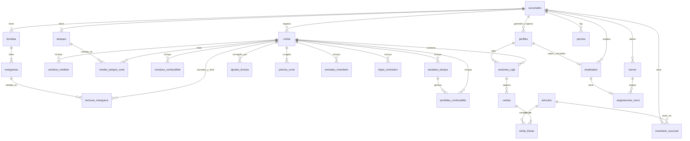

# BASE DE DATOS — diseño para Supabase (PostgreSQL)

Derivado de `docs/FLUJO.md` (temas 1–9). **Aplicado en Supabase el 2026-10-03/04: 14 migraciones en `supabase/migrations/` (las versiones coinciden con las del proyecto).**
Las 3 últimas refinan solo la vista `v_nivel_tanque_estimado` tras las pruebas. Verificado con pruebas reales dentro de transacciones
que se deshicieron (no quedó ningún dato de prueba): ver la sección 10.
Proyecto destino: `app_gasolinera` (ref `kpzdedcztufqwsqoywdp`, organización "kathyAlgarin Personal", vacío al momento de escribir esto).
Orden de trabajo: revisar este documento → escribir migraciones SQL en `supabase/migrations/` → aplicarlas al
proyecto nuevo (con confirmación explícita del usuario).

---

## 1. Principios

1. **UUID** como llave primaria en todas las tablas y `creado_en timestamptz default now()`.
2. **Nada se borra.** Sucursales, usuarios, empleados, artículos y turnos se **desactivan** (`activo`/`activa`).
   Cortes cerrados, ventas y cierres de caja **no se pueden modificar** (disparadores). Las ventas se **anulan**, no se borran.
3. **Las reglas viven en la BD**, no en los clientes: el cierre del corte, el registro de una venta, etc. son
   **funciones del servidor** que validan y calculan. La app iOS y la web solo llaman funciones y leen vistas.
4. **RLS** (permisos por fila): el Gerente de Sucursal y el Cajero solo ven y tocan lo de **su** sucursal.
5. **Nombres en español**, en `snake_case`, sin tildes ni eñes.
6. **Todo lo que se puede derivar no se guarda**: el nivel estimado de un tanque, la lectura inicial de un corte,
   las ventas de combustible y el cuadre se calculan en **vistas**. Así un ajuste se propaga solo y nada queda desincronizado.
7. **Consistencia por sucursal**: cada tabla operativa lleva `sucursal_id` y usa **llaves foráneas compuestas**
   `(id, sucursal_id)`, de modo que un registro nunca puede apuntar a datos de otra sucursal. Esto además
   simplifica las políticas RLS (`sucursal_id = mi_sucursal()`).
8. **Unidades**: galones `numeric(12,2)`, dinero USD `numeric(12,2)`. Todos los `CHECK` rechazan negativos.
   Cantidades de tienda: `integer`.
9. **Zona horaria**: se guarda `timestamptz`; las fechas "del día" se calculan en `America/El_Salvador` (UTC−6, sin horario de verano).

---

## 2. Tipos enumerados

| Tipo | Valores |
|---|---|
| `rol_usuario` | `gerente_general`, `gerente_sucursal`, `cajero` |
| `combustible` | `super`, `regular`, `diesel` |
| `estado_corte` | `en_curso`, `cerrado` |
| `tipo_corte` | `matutino`, `vespertino` |
| `tipo_perdida` | `merma`, `fuga`, `falla_tecnica`, `derrame`, `contaminacion` |
| `origen_linea` | `manual`, `vaciado` (líneas generadas automáticamente por el vaciado de tanque) |
| `motivo_vaciado` | `descarga_erronea`, `otra_contaminacion_mantenimiento` |
| `tipo_articulo` | `producto`, `servicio` |
| `categoria_articulo` | `lubricantes`, `bebidas`, `snacks`, `otros_productos`, `servicios` |
| `motivo_baja` | `vencido`, `danado`, `otro` |
| `metodo_pago` | `efectivo`, `tarjeta` (simulada) |
| `estado_venta` | `completada`, `anulada` |
| `cargo_empleado` | `despachador`, `cajero`, `supervisor`, `mantenimiento`, `otro` |

---

## 3. Tablas

### 3.1 Estructura y acceso

**`sucursales`**: `id`, `nombre` (único sin distinguir mayúsculas), `direccion`, `tiene_tienda` (bool, default false),
`activa` (bool, default true), `creado_en`.

**`perfiles`**: `id` (= `auth.users.id`), `correo` (único), `nombre`, `rol`, `sucursal_id` (null para gerente general),
`activo`, `debe_cambiar_password` (default true), `creado_en`.
- `CHECK`: `rol = 'gerente_general'` ⇔ `sucursal_id IS NULL`.
- Índice único parcial: **un solo `gerente_sucursal` activo por sucursal**.
- Disparador: no se puede desactivar al **último gerente general activo** ni a uno mismo.
- Las filas las crea la Edge Function de alta de usuarios (con la clave de servicio), nunca el cliente.

**`configuracion`**: `clave` (PK), `valor` (numeric), `descripcion`. Solo lectura desde las apps. Valores iniciales:

| clave | valor | uso |
|---|---|---|
| `tanque_critico_pct` | 20 | estado Crítico por porcentaje (≤) |
| `tanque_medio_pct` | 50 | estado Medio por porcentaje (≤) |
| `autonomia_critica_dias` | 2 | estado Crítico por autonomía (<) |
| `autonomia_media_dias` | 5 | estado Medio por autonomía (<) |
| `autonomia_ventana_dias` | 7 | días de historial para el promedio de venta |
| `tolerancia_cuadre_pct` | **0.5 (confirmado)** | % de los galones despachados bajo el cual la diferencia del cuadre se considera "cuadra" |

### 3.2 Infraestructura física

**`tanques`**: `id`, `sucursal_id`, `combustible`, `numero` (smallint, default 1), `capacidad_gal` (> 0),
`nivel_inicial_gal` (≥ 0, ≤ capacidad; el capturado al crear la sucursal), `creado_en`.
`UNIQUE (sucursal_id, combustible, numero)`; `UNIQUE (id, sucursal_id)`.
(`numero` permite más de un tanque por combustible en el futuro; hoy la app crea uno.)

**`bombas`**: `id`, `sucursal_id`, `numero` (1–6), `UNIQUE (sucursal_id, numero)`, `UNIQUE (id, sucursal_id)`.

**`mangueras`**: `id`, `bomba_id`, `sucursal_id`, `combustible`, `UNIQUE (bomba_id, combustible)`,
`UNIQUE (id, sucursal_id)`. FK compuesta `(bomba_id, sucursal_id) → bombas`.

Al crear una sucursal, la función `crear_sucursal` genera: 3 tanques, 6 bombas, 18 mangueras y el **primer corte en curso**.

### 3.3 Cortes de combustible

**`cortes`**: `id`, `sucursal_id`, `secuencia` (int, 1, 2, 3…), `estado`, `abierto_en`, `cerrado_en`, `cerrado_por`,
`tipo` (`tipo_corte`, null hasta cerrar), `fecha_operativa` (date, null hasta cerrar), `creado_en`.
- `UNIQUE (sucursal_id, secuencia)`; `UNIQUE (id, sucursal_id)`.
- Índice único parcial: **un solo corte `en_curso` por sucursal**.
- `UNIQUE (sucursal_id, fecha_operativa, tipo)` entre los cerrados.
- Un corte cerrado es **inmutable** (disparador).

**`lecturas_manguera`**: `id`, `corte_id`, `sucursal_id`, `manguera_id`, `lectura_inicial_manual_gal` (solo en el primer
corte de la sucursal), `lectura_final_gal`, `guardada_en`. `UNIQUE (corte_id, manguera_id)`.
Es el **borrador por bomba**: editable mientras el corte esté `en_curso`.
- La lectura inicial de los demás cortes **se deriva** de la final efectiva (con ajustes) del corte anterior.
- `lectura_final ≥ lectura inicial` (se valida en la función, porque la inicial es derivada), salvo manguera con cambio de medidor.

**`cambios_medidor`**: `id`, `corte_id`, `sucursal_id`, `manguera_id`, `lectura_final_viejo_gal`,
`lectura_inicial_nuevo_gal`, `nota` (obligatoria), `registrado_por`, `creado_en`. `UNIQUE (corte_id, manguera_id)`.
Galones de esa manguera = `(final_viejo − inicial) + (final − inicial_nuevo)`.

**`niveles_tanque_corte`**: `id`, `corte_id`, `sucursal_id`, `tanque_id`, `nivel_medido_gal` (≥ 0, ≤ capacidad,
validado en la función). `UNIQUE (corte_id, tanque_id)`.

**`compras_combustible`**: `id`, `corte_id`, `sucursal_id`, `tanque_id`, `galones` (> 0), `proveedor` (null),
`origen` (`origen_linea`, default `manual`), `creado_por`, `creado_en`.
Una compra `manual` no puede superar el espacio libre del tanque (validado en la función).

**`perdidas_combustible`**: `id`, `corte_id`, `sucursal_id`, `tanque_id`, `tipo`, `galones` (> 0), `bomba_id` (null),
`nota` (obligatoria), `origen`, `vaciado_id` (null), `creado_por`, `creado_en`.
Una pérdida `manual` no puede superar el nivel teórico del tanque. Tipo `contaminacion` solo lo genera el vaciado.

**`vaciados_tanque`**: `id`, `corte_id`, `sucursal_id`, `tanque_id`, `motivo`, `combustible_erroneo` (null),
`galones_erroneos` (null, > 0 si hay combustible erróneo), `nivel_medido_gal`, `nota`, `registrado_por`, `creado_en`.
- `CHECK`: motivo `descarga_erronea` ⇒ `combustible_erroneo` y `galones_erroneos` no nulos, `combustible_erroneo` ≠
  combustible del tanque y `galones_erroneos ≤ nivel_medido_gal`.
- La función `registrar_vaciado` genera las líneas de pérdida/compra con `origen = 'vaciado'` (ver sección 5).

**`ajustes_lectura`**: `id`, `corte_id`, `sucursal_id`, `manguera_id`, `valor_correcto_gal`, `motivo` (obligatorio),
`ajustado_por`, `creado_en`. **Inmutable.** Solo se permite si el corte siguiente **no está cerrado**.
La lectura final efectiva = el ajuste más reciente, o la original.

### 3.4 Precios

**`precios`**: `id`, `sucursal_id`, `combustible`, `precio_gal` (> 0, 2 decimales), `vigente_desde` (timestamptz, default now),
`creado_por`, `creado_en`. `UNIQUE (sucursal_id, combustible, vigente_desde)`. Nunca se actualiza: cada cambio es una fila nueva.
Precio vigente = la fila con mayor `vigente_desde ≤ now()`.

**`precios_corte`**: `corte_id`, `sucursal_id`, `combustible`, `precio_gal`. PK `(corte_id, combustible)`.
Copia del precio vigente **al cerrar** el corte. Inmutable.

### 3.5 Tienda y servicios

**`articulos`**: `id`, `nombre` (único sin distinguir mayúsculas), `categoria`, `tipo`, `precio_usd` (> 0), `activo`, `creado_en`.
`CHECK`: categoría `servicios` ⇔ tipo `servicio`.

**`inventario_sucursal`**: `sucursal_id`, `articulo_id`, `stock` (int ≥ 0), `stock_minimo` (int ≥ 0). PK `(sucursal_id, articulo_id)`.
Solo para artículos tipo `producto` y sucursales con `tiene_tienda`. Se crea al activar la tienda y al crear un artículo.
**Solo lo modifican las funciones** (venta, anulación, entrada, baja).

**`entradas_inventario`**: `id`, `corte_id`, `sucursal_id`, `articulo_id`, `cantidad` (> 0), `proveedor` (null), `creado_por`, `creado_en`.

**`bajas_inventario`**: `id`, `corte_id`, `sucursal_id`, `articulo_id`, `cantidad` (> 0), `motivo`, `nota` (null), `creado_por`, `creado_en`.
La cantidad no puede superar el stock.

**`sesiones_caja`** (el "Cierre de caja" en la UI): `id`, `sucursal_id`, `cajero_id`, `corte_id` (el corte en curso al abrir),
`fondo_inicial_usd` (≥ 0), `abierta_en`, `cerrada_en`, `efectivo_contado_usd`, `efectivo_esperado_usd`, `diferencia_usd`,
`cierre_forzado` (bool, default false), `cerrada_por`, `motivo_cierre_forzado`.
- Índice único parcial: **una sola sesión abierta por cajero**.
- `efectivo_esperado = fondo_inicial + Σ total de ventas completadas en efectivo`; `diferencia = contado − esperado`
  (se guardan al cerrar; después son inmutables).
- `CHECK`: `cierre_forzado` ⇒ `motivo_cierre_forzado` no nulo y `cerrada_por` ≠ `cajero_id`.

**`contadores_ticket`**: `sucursal_id` (PK), `ultimo` (bigint). Numera los tickets por sucursal (con bloqueo de fila).

**`ventas`**: `id`, `sucursal_id`, `sesion_caja_id`, `corte_id`, `cajero_id`, `numero` (por sucursal, `UNIQUE (sucursal_id, numero)`),
`total_usd` (> 0), `metodo_pago`, `recibido_usd`, `vuelto_usd`, `estado`, `anulada_por`, `anulada_en`, `motivo_anulacion`, `creado_en`.
- `CHECK` efectivo: `recibido ≥ total` y `vuelto = recibido − total`. `CHECK` tarjeta: `recibido` y `vuelto` nulos.
- `CHECK` anulada ⇒ `anulada_por`, `anulada_en` y `motivo_anulacion` no nulos.
- Solo cambia de `completada` a `anulada`, nunca se borra ni se edita otra cosa (disparador).

**`venta_lineas`**: `id`, `venta_id`, `sucursal_id`, `articulo_id`, `cantidad` (int > 0), `precio_unitario_usd` (copia del
catálogo al vender), `subtotal_usd` (= cantidad × precio). Inmutable.

### 3.6 Personal

**`empleados`**: `id`, `sucursal_id`, `nombre`, `cargo`, `telefono` (null), `fecha_ingreso` (null), `activo`,
`perfil_id` (null, único; vincula a un cajero con usuario), `creado_en`. Sin DUI.

**`turnos`**: `id`, `sucursal_id`, `nombre`, `hora_inicio` (time), `hora_fin` (time), `activo`. `CHECK (hora_inicio <> hora_fin)`.
Si `hora_fin < hora_inicio`, el turno termina al día siguiente. Se permiten solapes y huecos.

**`asignaciones_turno`**: `empleado_id` (PK, un turno por empleado), `turno_id`, `sucursal_id`, `dias` (smallint[], valores 1–7, no vacío).

---

## 4. Diagrama de relaciones

---

## 5. Funciones del servidor (las apps solo llaman a estas)

Todas verifican el rol y la sucursal de quien llama (`SECURITY DEFINER` con comprobaciones explícitas) y corren en una
sola transacción. Los clientes **no** calculan totales.

| Función | Quién | Qué hace y valida |
|---|---|---|
| `crear_sucursal(nombre, direccion, tiene_tienda, tanques)` | GG | Crea sucursal + 3 tanques + 6 bombas + 18 mangueras + corte n.º 1 en curso (+ inventario si hay tienda). Valida capacidades > 0 y nivel inicial ≤ capacidad. |
| `editar_sucursal`, `activar_sucursal`, `desactivar_sucursal` | GG | `tiene_tienda` solo se apaga sin cajas abiertas. |
| `fijar_precio(sucursales[], combustible, precio)` | GG | Inserta una fila en `precios` por sucursal (aplicar a todas a la vez o una por una). |
| `guardar_lecturas_bomba(corte_id, bomba_id, lecturas)` | GS | Guarda/edita las 3 lecturas de una bomba en el corte en curso (borrador). Rechaza negativos y `final < inicial`. En el primer corte exige las iniciales. |
| `registrar_cambio_medidor(...)` | GS | Ver 3.3. Nota obligatoria. |
| `registrar_compra`, `editar_compra`, `eliminar_compra` | GS | Solo en corte en curso; compra ≤ espacio libre. |
| `registrar_perdida`, `editar_perdida`, `eliminar_perdida` | GS | Solo en corte en curso; pérdida ≤ nivel teórico; nota obligatoria. |
| `registrar_vaciado(...)` | GS | Motivo 1: pérdida `contaminacion` del combustible del tanque por `nivel_medido − galones_erroneos`; compra y pérdida `contaminacion` del combustible erróneo por `galones_erroneos` (neto cero, sin validar espacio libre); tanque en 0. Motivo 2: pérdida `contaminacion` por el nivel medido; tanque en 0. |
| `cerrar_corte(corte_id, niveles, tipo_inicial?)` | GS | Exige las 18 lecturas, 3 niveles medidos, los 3 precios vigentes, **ninguna caja abierta** (si hay tienda) y el orden de la cadena. Congela `precios_corte`, asigna `tipo` y `fecha_operativa`, marca `cerrado` y **abre el siguiente corte**. |
| `registrar_ajuste(corte_id, manguera_id, valor, motivo)` | GG | Solo si el corte siguiente no está cerrado. |
| `registrar_entrada`, `registrar_baja` | GS | Solo en corte en curso; suben/bajan stock. |
| `abrir_caja(fondo_inicial)` | Cajero | Una sola abierta por cajero; solo si la sucursal tiene tienda. |
| `registrar_venta(sesion_id, metodo, recibido, lineas)` | Cajero | Lee precios del catálogo, calcula total y vuelto, valida stock, descuenta stock, numera el ticket. |
| `anular_venta(venta_id, motivo)` | GS | Solo mientras la sesión de caja de esa venta siga abierta; devuelve stock y excluye la venta del efectivo esperado. |
| `cerrar_caja(sesion_id, efectivo_contado)` | Cajero | Calcula esperado y diferencia; la sesión queda inmutable. |
| `cerrar_caja_forzado(sesion_id, efectivo_contado, motivo)` | GS | Igual, marcada `cierre_forzado`. |
| `empleados_en_turno(sucursal_id, momento)` | GS, GG | Empleados activos cuyo turno incluye ese momento, considerando días de la semana y turnos que cruzan la medianoche. |

**Edge Function `gestionar-usuarios`** (usa la clave de administrador, que nunca va en las apps).
Código en `supabase/functions/gestionar-usuarios/index.ts`. **Estado: escrita, NO desplegada** (la conexión de Supabase de
la sesión no tiene permiso de Edge Functions; se despliega a mano desde el panel). `POST` con la sesión del usuario en
`Authorization: Bearer <access_token>` y un JSON con `accion`:

| `accion` | Cuerpo | Quién | Resultado |
|---|---|---|---|
| `crear` | `correo`, `nombre`, `rol`, `sucursal_id` (según el rol), `password_temporal` | GG: cualquier rol. GS: solo `cajero` de su sucursal (ignora `sucursal_id`) | `201 {id}` |
| `restablecer_password` | `usuario_id`, `password_temporal` | GG: cualquiera. GS: cajeros de su sucursal | `200 {ok:true}`; el usuario debe cambiarla al entrar |
| `cambiar_estado` | `usuario_id`, `activo` (boolean) | GG: cualquiera. GS: cajeros de su sucursal | `200 {ok:true}`; además bloquea/desbloquea el inicio de sesión |
| `cambiar_correo` | `usuario_id`, `correo` | GG: cualquiera. GS: cajeros de su sucursal | `200 {ok:true}`; cambia el correo de inicio de sesión y el del perfil (se revierte si falla); correo repetido → 409; no sobre uno mismo |

Errores: `{ "error": "mensaje en español" }` con 400 (datos inválidos), 401 (sin sesión válida), 403 (sin permiso), 404, 409
(duplicados: correo repetido, sucursal con gerente activo) o 500. Reglas: contraseña temporal de 8 a 72 caracteres; no se actúa
sobre el propio usuario; el cajero no puede usar la función; un cajero solo se crea en una sucursal con tienda; si falla la
creación del perfil se deshace la del usuario de autenticación; el último Gerente General no se puede desactivar (lo impone la BD).
Para listar usuarios no hace falta la función: las apps leen `perfiles` y el RLS ya filtra por rol y sucursal.

---

## 6. Vistas (todas con `security_invoker`, así respetan RLS)

| Vista | Contenido |
|---|---|
| `v_lecturas_efectivas` | Por corte y manguera: lectura inicial (manual o derivada de la final efectiva del corte anterior), final efectiva (con ajustes), galones (con cambio de medidor). |
| `v_ventas_combustible_corte` | Por corte y combustible: galones vendidos, ingreso USD (galones × `precios_corte`). |
| `v_nivel_tanque_estimado` | Nivel medido del último corte cerrado (o `nivel_inicial_gal` si no hay) + compras − pérdidas del corte en curso; un vaciado reinicia la base a 0. Incluye cuántas compras y pérdidas del corte en curso lo afectan. |
| `v_estado_tanque` | Porcentaje, autonomía (nivel ÷ promedio diario de los últimos 7 días de cortes cerrados) y estado Crítico/Medio/Óptimo = el peor de ambos; sin historial usa solo el porcentaje. |
| `v_cuadre_tanque_corte` | Por corte y tanque: nivel inicial, compras, galones del medidor, pérdidas, nivel teórico, medido, diferencia y bandera `hay_diferencia` según `tolerancia_cuadre_pct`. |
| `v_resumen_corte` | Reporte consolidado del corte (6 bombas, combustibles, compras, pérdidas, cuadre, marcas "Ajustado" y "Cambio de medidor"). |
| `v_dashboard_combustible` | Métricas por sucursal/combustible/día para el filtro del Gerente General (solo cortes cerrados) y número de cortes con datos. |
| `v_tienda_ingresos` | Ingreso y unidades por sucursal, día operativo y categoría (ventas completadas en cortes cerrados). |
| `v_tienda_anulaciones` | Ventas anuladas y su total por sucursal y día operativo. |
| `v_tienda_cajas` | Cada cierre de caja: fondo, esperado, contado, diferencia y si fue forzado. |
| `v_stock_bajo` | Productos activos con stock menor o igual al mínimo, por sucursal. |
| *Límite conocido* | `v_cuadre_tanque_corte` asume **un tanque por combustible** en cada sucursal (lo que crea hoy la app). |

---

## 7. Permisos por rol (RLS)

| Tabla / grupo | Gerente General | Gerente de Sucursal | Cajero |
|---|---|---|---|
| `sucursales` | leer todas; escribir vía funciones | leer la suya | leer la suya |
| `perfiles` | leer todos; escribir vía Edge Functions | leer los de su sucursal | leer el suyo |
| Infraestructura (`tanques`, `bombas`, `mangueras`) | leer todo | leer su sucursal | — |
| Corte y combustible (`cortes`, lecturas, niveles, compras, pérdidas, vaciados, cambios, ajustes) | leer todo | leer su sucursal; escribir solo vía funciones | — |
| `precios`, `precios_corte` | leer todo; escribir vía `fijar_precio` | leer su sucursal | — |
| `articulos` | leer y escribir | leer activos | leer activos |
| `inventario_sucursal` | leer todo | leer su sucursal | leer su sucursal |
| Entradas y bajas de inventario | leer todo | leer su sucursal; escribir vía funciones | — |
| `sesiones_caja`, `ventas`, `venta_lineas` | leer todo | leer su sucursal | leer las propias |
| `empleados`, `turnos`, `asignaciones_turno` | leer todo | leer y escribir su sucursal | — |
| `configuracion` | leer | leer | — |

Reglas generales: **ninguna tabla tiene política de `DELETE`** y se revoca `DELETE` a los roles de la API. Las escrituras de
negocio solo entran por funciones. Los datos de un corte cerrado, una venta o una sesión cerrada no se pueden modificar.

---

## 8. Decisiones que surgieron al diseñar (revisar)

1. **Tipo del corte (Matutino/Vespertino).** Se asigna **al cerrar**, no al abrir. El primer corte de una sucursal lo
   elige el gerente; desde el segundo **alternan** Matutino/Vespertino. La `fecha_operativa` del Matutino es la fecha de
   su cierre; el **Vespertino hereda la del Matutino** que lo precede, aunque cierre pasada la medianoche. Así nunca hay
   más de 2 cortes por día operativo y la cadena de lecturas no se rompe.
2. **Tolerancia del cuadre.** El indicador "cuadra / hay diferencia" necesita un umbral. **Confirmado: 0.5 %** de los
   galones despachados en el periodo. No sale de ninguna norma; queda en `configuracion` para cambiarlo.
3. **El nivel del tanque no se guarda**: se deriva (vista). Evita que una actualización olvidada deje el dato incorrecto.
4. **El primer corte se abre automáticamente al crear la sucursal**, así siempre hay un corte en curso donde registrar
   compras y pérdidas.
5. **Las líneas generadas por el vaciado** (`origen = 'vaciado'`) no pasan las validaciones de espacio libre ni
   de nivel teórico, porque ese combustible nunca entró físicamente al tanque de su tipo.
6. **No se incluye** bitácora general de auditoría (solo `creado_por`/`registrado_por` donde corresponde), facturación
   electrónica (DTE), notificaciones push ni devoluciones posteriores al cierre de caja.

---

## 9. Orden de migraciones previsto (`supabase/migrations/`)

1. Tipos enumerados y `configuracion`.
2. `sucursales`, `perfiles`, infraestructura (`tanques`, `bombas`, `mangueras`).
3. Cortes y combustible (`cortes` … `ajustes_lectura`), precios.
4. Tienda (`articulos` … `venta_lineas`) y personal.
5. Disparadores de inmutabilidad y de reglas (último gerente general, un gerente por sucursal).
6. Vistas.
7. Funciones del servidor.
8. Políticas RLS y permisos (`GRANT`/`REVOKE`).
9. Datos iniciales (`configuracion`) y creación manual del primer Gerente General.
10. Refinamientos de `v_nivel_tanque_estimado` (3 migraciones, tras las pruebas).

---

## 10. Verificación realizada (pruebas reales, transacciones deshechas)

Se probaron con usuarios de prueba (Gerente General, dos Gerentes de Sucursal y un Cajero) que **no persisten**:

- Crear sucursal genera 6 bombas, 18 mangueras, 3 tanques y el corte 1 en curso.
- Rechazos: lectura negativa, final menor que inicial, compra mayor al espacio libre, pérdida mayor al nivel, contaminación manual,
  cierre sin lecturas / sin niveles / con nivel sobre la capacidad / con cajas abiertas, tercer corte del mismo día,
  precio negativo, venta sin stock / con cantidad 0 / con recibido menor al total.
- Inmutabilidad: no se edita ni se reabre un corte cerrado, no se borra un corte, no se agrega una compra a un corte cerrado,
  no se edita una caja cerrada, no se anula una venta con la caja cerrada.
- Cálculos: cuadre (teórico, diferencia y bandera con la tolerancia de 0.5 %), ventas e ingreso por combustible, ajuste que se
  propaga a la lectura inicial del corte siguiente, Vespertino que hereda la fecha del Matutino, vaciado por descarga errónea
  (pérdidas, compra neta y tanque en 0), venta con vuelto, stock tras ventas y anulación, cierre de caja (esperado y diferencia),
  cierre forzado, turno nocturno que cruza la medianoche.
- Seguridad: el cajero solo ve sus ventas y no ve cortes ni tanques; un Gerente de Sucursal no ve ni escribe en otra sucursal;
  no se editan precios desde la API; el usuario anónimo no lee nada; un solo Gerente de Sucursal activo por sucursal;
  no se desactiva al último Gerente General ni uno mismo; no hay cajeros en sucursales sin tienda.
- Hallazgo corregido: la vista del nivel estimado dependía de comparar relojes; ahora ordena por la secuencia del corte y
  excluye por `vaciado_id` las líneas generadas por el vaciado (migraciones 10–12).

### Migraciones 13 y 14 (aplicadas el 2026-10-04)

- `20261004173102_resumen_previo_corte.sql`: función `resumen_previo_corte(corte, niveles)` (solo lectura) para mostrar el resumen **antes** de cerrar el
  corte con las mismas fórmulas de `v_cuadre_tanque_corte`. Verificada en una transacción deshecha: devuelve exactamente lo que después registra `cerrar_corte`.
- `20261004173103_fijar_stock_minimo.sql`: función `fijar_stock_minimo(articulo, minimo)` para el Gerente de Sucursal (ninguna función permitía fijar el
  mínimo, que quedaba siempre en 0). Verificada en la misma transacción.

**No probado todavía**: el camino de éxito de la Edge Function `gestionar-usuarios` (necesita una sesión real), el flujo de contraseña por correo
(requiere el SMTP), el rendimiento con volumen real y el uso de las apps con una **sesión real** (la app se verificó compilando, con pruebas de lógica,
con JSON real del servidor decodificado por los modelos y recorrida en el simulador).
