# Guía de pantallas de la app

Qué hace cada pantalla de la app iOS de **Gasolineras 76**, para qué sirve y cómo funciona, con capturas, para los tres roles: **Gerente General**, **Gerente de Sucursal** y **Cajero**.

> Capturas tomadas el 2026-10-04 en el simulador iPhone 17, contra el servidor real. Los datos de las sucursales Centro, Santa Ana y Aeropuerto son **datos de ejemplo**; los de Metrocentro son pruebas de la usuaria. Hay un video por rol en `docs/video/`.

## Contenido

- [1. Acceso y cuenta (todos los roles)](#1-acceso-y-cuenta-todos-los-roles)
- [2. Gerente General](#2-gerente-general)
- [3. Gerente de Sucursal](#3-gerente-de-sucursal)
- [4. Cajero](#4-cajero)
- [5. Cómo se lee la app (conceptos comunes)](#5-cómo-se-lee-la-app-conceptos-comunes)
- [6. Lo que no se pudo capturar](#6-lo-que-no-se-pudo-capturar)

## 1. Acceso y cuenta (todos los roles)

Estas pantallas son las mismas para el Gerente General, el Gerente de Sucursal y el Cajero. Después de iniciar sesión, la app muestra solo lo que le corresponde al rol.

### Inicio de sesión

| 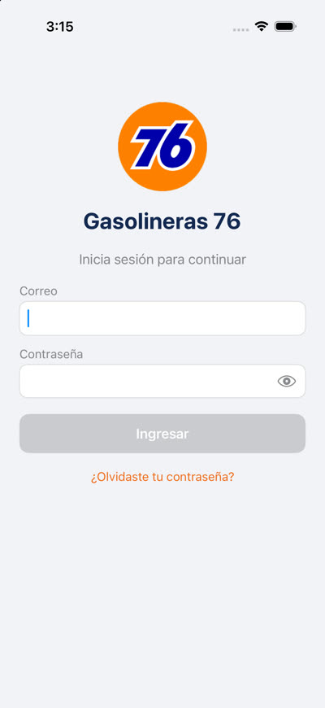 |
|---|
| *Login* |

**Qué es y para qué sirve.** Es la puerta de entrada. Sirve para identificarse con el correo y la contraseña de la cuenta que creó el Gerente General.

**Cómo funciona.**

- Se escribe el **correo** y la **contraseña** (el ojo la muestra u oculta). **Ingresar** queda gris hasta que ambos campos tengan algo.
- Si los datos son incorrectos aparece el mensaje «Correo o contraseña incorrectos.» y desaparece al volver a escribir.
- Si la cuenta tiene una **contraseña temporal**, la app lleva primero a «Cambia tu contraseña» (más abajo). Si no, entra directo al inicio del rol.
- Una cuenta desactivada no puede entrar.
- **¿Olvidaste tu contraseña?** abre la recuperación.

### Recuperar contraseña · paso 1: correo

| 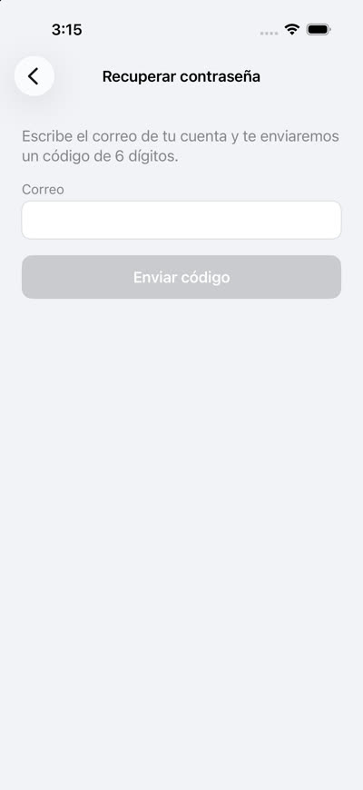 |
|---|
| *Paso 1* |

**Qué es y para qué sirve.** Primer paso para quien olvidó su contraseña: la app envía un código de 6 dígitos al correo de la cuenta.

**Cómo funciona.**

- Se escribe el correo (si ya se había escrito en el login, llega precargado). **Enviar código** se habilita cuando el formato es válido.

### Recuperar contraseña · paso 2: código

**Qué es y para qué sirve.** Segundo paso: se escribe el código recibido por correo.

**Cómo funciona.**

- Seis casillas que se llenan con un solo teclado numérico. **Verificar** se habilita cuando están las 6.
- Si el código es incorrecto o venció: «Código incorrecto o vencido.»
- **Reenviar código** tiene una espera con cuenta regresiva en segundos. **Cambiar correo** vuelve al paso 1.

> 📷 **Sin captura.** Este flujo lo prueba la usuaria directamente (implica escribir su correo y un código de verificación), por eso no se grabó ni se capturó. El envío del código depende del SMTP del proyecto Supabase, que sigue pendiente de configurar y de probar.

### Recuperar contraseña · paso 3: nueva contraseña

**Qué es y para qué sirve.** Último paso: definir la contraseña nueva.

**Cómo funciona.**

- Nueva contraseña y confirmación, de 8 a 72 caracteres. **Guardar** se habilita cuando coinciden.
- Al terminar, vuelve al login con un aviso de éxito.

> 📷 **Sin captura.** Mismo motivo que el paso 2.

### Cambio de contraseña obligatorio

**Qué es y para qué sirve.** Aparece justo después de entrar con una **contraseña temporal** (cuentas nuevas o con contraseña restablecida). No deja usar la app hasta cambiarla.

**Cómo funciona.**

- Pantalla completa sin botón «atrás»: título «Cambia tu contraseña» y el texto «Entraste con una contraseña temporal. Define una nueva para continuar.»
- Nueva y confirmar (8 a 72 caracteres). **Guardar** cambia la contraseña, apaga la bandera de «debe cambiarla» y entra al inicio del rol.
- Arriba a la derecha hay **Cerrar sesión** por si no se quiere continuar.

> 📷 **Sin captura.** Es una pantalla que aparece una sola vez por cuenta y pide escribir contraseñas, así que no se capturó. La usuaria la vio al entrar con las cuentas de ejemplo.

### Perfil

| 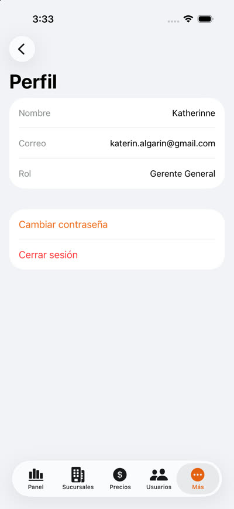 | 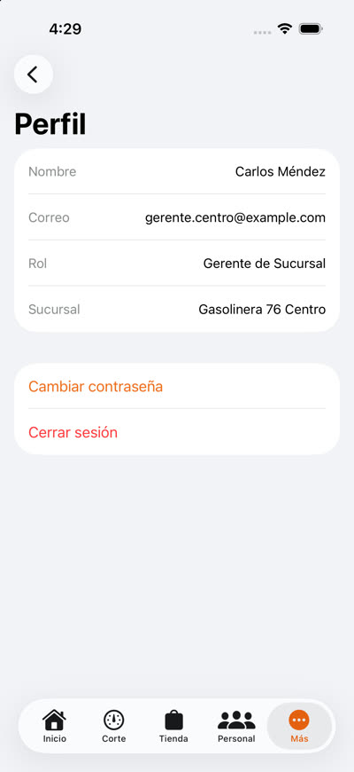 | 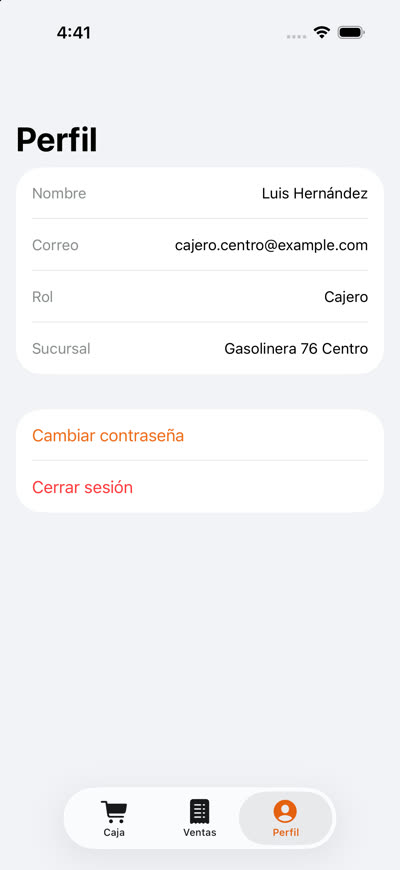 |
|---|---|---|
| *Perfil del Gerente General* | *Perfil del Gerente de Sucursal* | *Perfil del Cajero* |

**Qué es y para qué sirve.** Muestra los datos de la cuenta y permite cambiar la contraseña o cerrar sesión. Existe en los tres roles; el Gerente de Sucursal y el Cajero ven además su sucursal.

**Cómo funciona.**

- Nombre, correo, rol (y sucursal) en solo lectura: no se editan aquí.
- **Cambiar contraseña** abre una hoja (siguiente captura). **Cerrar sesión** pide confirmación y vuelve al login.

### Cambiar contraseña (hoja) y confirmar «Cerrar sesión»

| 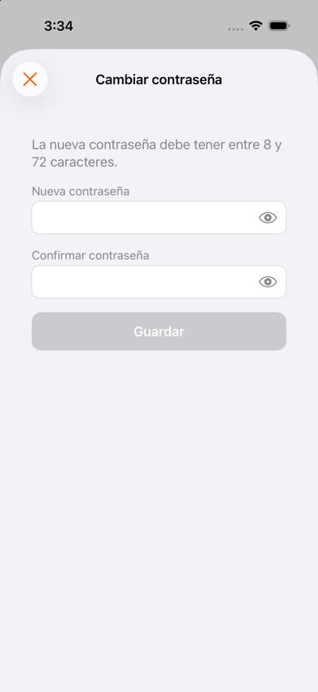 | 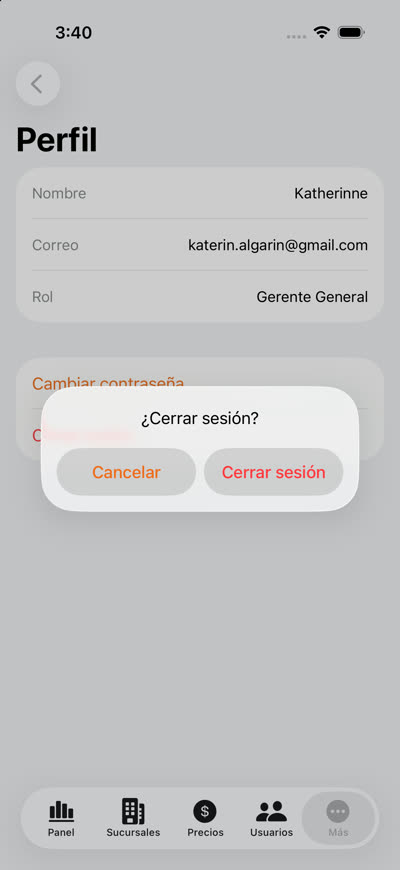 |
|---|---|
| *Hoja «Cambiar contraseña»* | *Confirmación de cerrar sesión* |

**Qué es y para qué sirve.** Cambio voluntario de contraseña, y la ventana que evita cerrar la sesión por accidente.

**Cómo funciona.**

- La hoja pide nueva contraseña y confirmación (8 a 72 caracteres); **Guardar** queda gris hasta que sean válidas y coincidan.
- En la ventana «¿Cerrar sesión?», **Cancelar** no hace nada y **Cerrar sesión** vuelve al login.

## 2. Gerente General

Ve **toda la franquicia**: todas las sucursales, sus precios, usuarios y catálogo. Su barra inferior tiene cinco pestañas: **Panel · Sucursales · Precios · Usuarios · Más**. Consulta los cortes de las sucursales, pero **no los registra**. Es el único que puede fijar precios, crear usuarios y ajustar una lectura de un corte ya cerrado.

### Panel

| 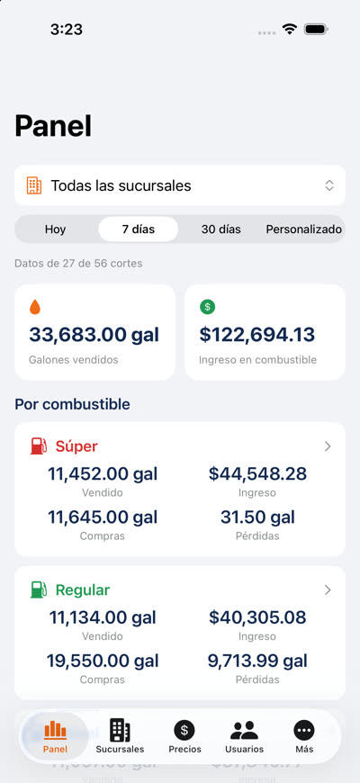 | 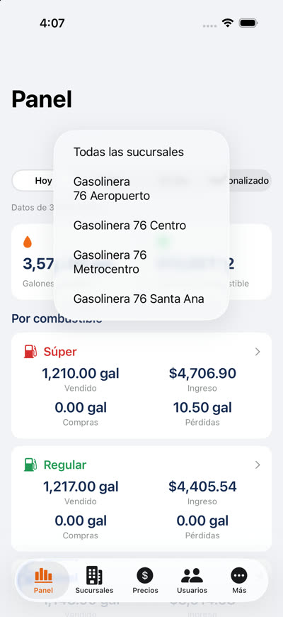 |
|---|---|
| *Panel, 7 días, todas las sucursales* | *Menú de sucursal* |

**Qué es y para qué sirve.** Es el tablero principal: resume las ventas de combustible y los problemas que requieren atención, para una sucursal o para todas.

**Cómo funciona.**

- **Sucursal** (menú desplegable): «Todas las sucursales» o una en concreto; todas las cifras se recalculan.
- **Periodo**: Hoy · 7 días · 30 días · Fechas. «Fechas» muestra dos fechas para elegir un rango (nunca futuro).
- El texto «Datos de 27 de 56 cortes» indica cuántos cortes **cerrados** entran en las cifras, de los que hay en el periodo. El servidor solo cuenta lo que ya cerró, porque las ventas de combustible se conocen al cerrar el corte.
- Tarjetas **Galones vendidos** e **Ingreso en combustible**, y debajo una tarjeta por combustible (Súper, Regular, Diésel) con vendido, ingreso, compras y pérdidas. Tocar una abre el detalle de ese combustible.
- Si no hay sucursales, en lugar de cifras sale «No hay datos todavía. Crea una sucursal en la pestaña Sucursales…».

> Nota: Esta captura y la del menú de sucursal se tomaron antes de renombrar la pestaña «Personalizado» a «Fechas»; la app actual dice «Fechas».

### Panel · rango de fechas

| 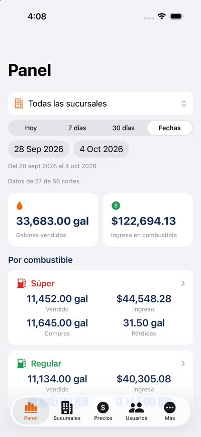 | 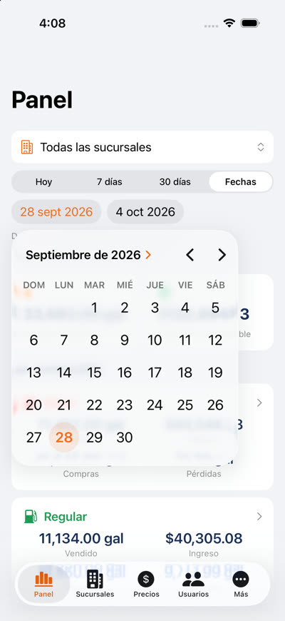 |
|---|---|
| *Pestaña «Fechas» con el rango* | *Calendario* |

**Qué es y para qué sirve.** Para ver cualquier periodo que no sea Hoy, 7 o 30 días.

**Cómo funciona.**

- Al elegir **Fechas** aparecen dos botones (desde y hasta) que abren un calendario en español. No permite fechas futuras ni un rango invertido.
- Al cambiar una fecha el panel se vuelve a cargar solo.

### Panel · tendencia, ranking y tanques críticos

| 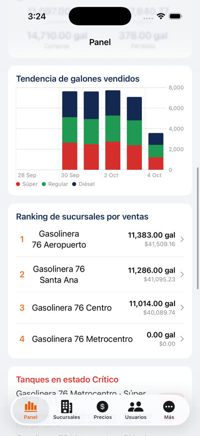 | 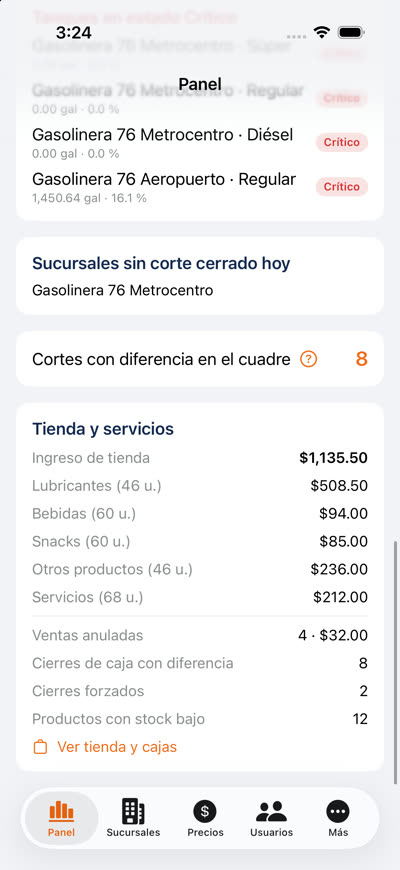 | 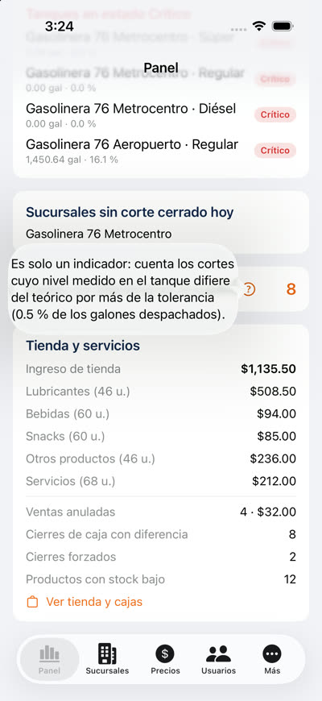 |
|---|---|---|
| *Tendencia y ranking* | *Críticos, cortes con diferencia y tienda* | *Ayuda del cuadre* |

**Qué es y para qué sirve.** La parte de abajo del Panel: cómo evolucionan las ventas y dónde hay que actuar.

**Cómo funciona.**

- **Tendencia de galones vendidos**: barras apiladas por día, con un color por combustible.
- **Ranking de sucursales por ventas**: ordenadas de mayor a menor; tocar una fila abre el detalle de la sucursal.
- **Tanques en estado Crítico**: lista de los tanques que están en rojo (20 % o menos, o poca autonomía). Tocar una fila abre esa sucursal.
- **Sucursales sin corte cerrado hoy**: aviso informativo.
- **Cortes con diferencia en el cuadre**: cuántos cortes tuvieron diferencia entre lo que marcó el medidor y lo que midió el tanque. El **?** explica la tolerancia del 0.5 %. Es un indicador, no una alerta que bloquee nada.

### Panel · bloque «Tienda y servicios»

|  |
|---|
| *Bloque de tienda al final del Panel* |

**Qué es y para qué sirve.** Resume la tienda de las sucursales **por separado del combustible**: ingreso por categoría (lubricantes, bebidas, snacks, otros productos, servicios), ventas anuladas, cierres de caja con diferencia, cierres forzados y productos con stock bajo.

**Cómo funciona.**

- El enlace **Ver tienda y cajas** abre el detalle completo (pantalla «Tienda y cajas», más abajo).

### Detalle de combustible

| 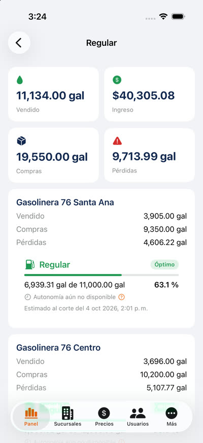 |
|---|
| *Regular* |

**Qué es y para qué sirve.** Muestra, para un combustible, cuánto vendió, compró y perdió cada sucursal en el periodo.

**Cómo funciona.**

- Cuatro tarjetas arriba: vendido, ingreso, compras y pérdidas.
- Debajo, una tarjeta por sucursal con sus cifras y la **fila del tanque**: galones, porcentaje de llenado, barra de color y estado (Óptimo/Medio/Crítico).
- La **autonomía** (días que dura el combustible) aparece cuando hay historial suficiente; el **?** explica cómo se calcula. «Estimado al corte del …» indica de cuándo es el dato.

### Detalle de sucursal (consulta)

| 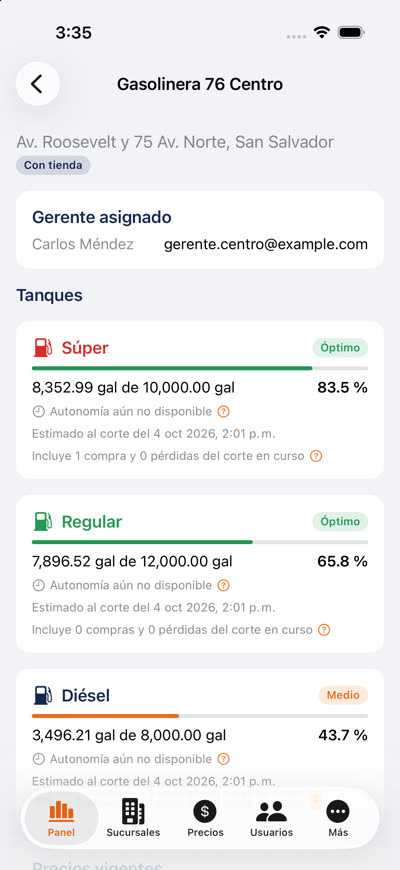 | 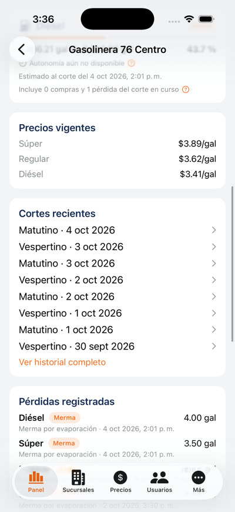 | 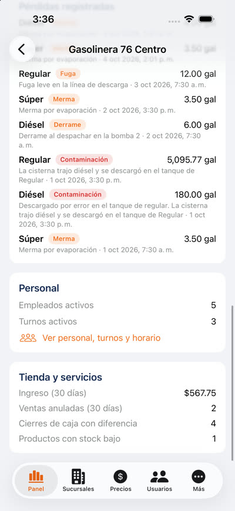 |
|---|---|---|
| *Encabezado y tanques* | *Precios, cortes recientes y pérdidas* | *Personal y tienda* |

**Qué es y para qué sirve.** Ficha completa de una sucursal para el Gerente General. Es solo de consulta: desde aquí no se registran cortes.

**Cómo funciona.**

- Arriba: dirección, etiqueta «Con tienda» y el **Gerente asignado** con su correo.
- **Tanques**: nivel estimado al último corte, porcentaje, estado, autonomía y el texto «Incluye N compras y M pérdidas del corte en curso».
- **Precios vigentes** por combustible. **Cortes recientes**: tocar uno abre su reporte; «Ver historial completo» lista todos.
- **Pérdidas registradas**: tipo (Merma, Fuga, Derrame, Contaminación…), galones y nota. **Personal**: empleados y turnos activos, con enlace a verlos. **Tienda y servicios** de los últimos 30 días.

### Reporte de un corte

| 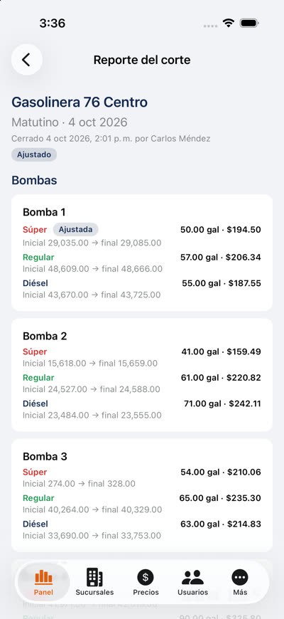 | 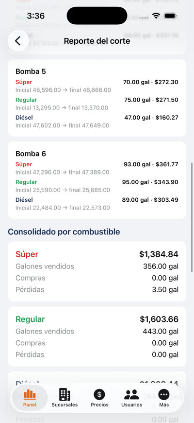 | 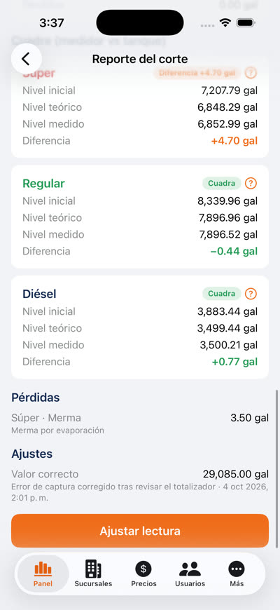 |
|---|---|---|
| *Encabezado y bombas* | *Bombas 5 y 6 y consolidado* | *Cuadre, pérdidas y ajustes* |

**Qué es y para qué sirve.** El documento de un corte cerrado: qué marcó cada manguera, cuánto se vendió y si el tanque cuadra con el medidor. También lo ve el Gerente de Sucursal.

**Cómo funciona.**

- Encabezado: sucursal, tipo (Matutino/Vespertino), fecha, hora de cierre y quién lo cerró. Etiquetas **Ajustado** y **Cambio de medidor** si aplican; se pueden tocar para ver qué significan.
- **Bombas**: las 6, con las 3 mangueras (Súper, Regular, Diésel): lectura inicial → final, galones y dólares.
- **Consolidado por combustible**: galones, ingreso, compras y pérdidas.
- **Cuadre (medidor vs tanque)**: nivel inicial, teórico, medido y diferencia; «Cuadra» (verde) o «Diferencia» (naranja). El **?** explica la regla: se considera que cuadra si la diferencia es menor al 0.5 % de los galones despachados.
- **Pérdidas** y **Ajustes** del corte (con el motivo escrito). Los números salen del servidor; la app no recalcula nada.

### Ajustar lectura (hoja, solo Gerente General)

| 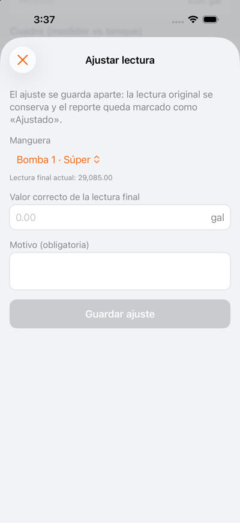 |
|---|
| *Hoja «Ajustar lectura»* |

**Qué es y para qué sirve.** Permite corregir una lectura de manguera de un corte ya cerrado cuando se descubre un error de captura. El corte no se reescribe: el ajuste se guarda aparte.

**Cómo funciona.**

- El botón **Ajustar lectura** aparece al final del reporte, solo si el corte siguiente sigue abierto. Si el siguiente ya se cerró, no aparece y el corte es definitivo.
- Se elige la **manguera**, se escribe el **valor correcto de la lectura final** (no puede ser menor a la lectura inicial) y un **motivo** obligatorio. **Guardar ajuste** queda gris hasta tener ambos.
- Después, el reporte muestra la etiqueta «Ajustado», la lectura original se conserva y el ajuste queda en la sección Ajustes.

> Nota: Se capturó la hoja vacía; no se guardó ningún ajuste (cambiaría un corte real).

### Sucursales

| 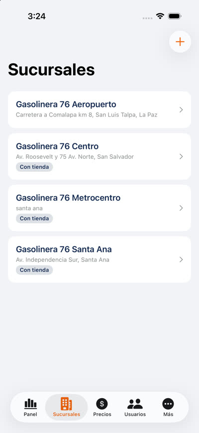 |
|---|
| *Lista de sucursales* |

**Qué es y para qué sirve.** Lista de todas las sucursales de la franquicia. Es el punto de partida para crear, editar o desactivar sucursales.

**Cómo funciona.**

- Cada fila muestra nombre y dirección, con las etiquetas **Con tienda** o **Inactiva**. Tocar una fila abre su edición.
- El **+** de arriba a la derecha abre «Nueva sucursal».

### Editar sucursal

| 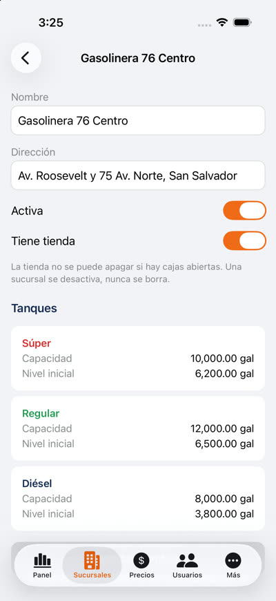 | 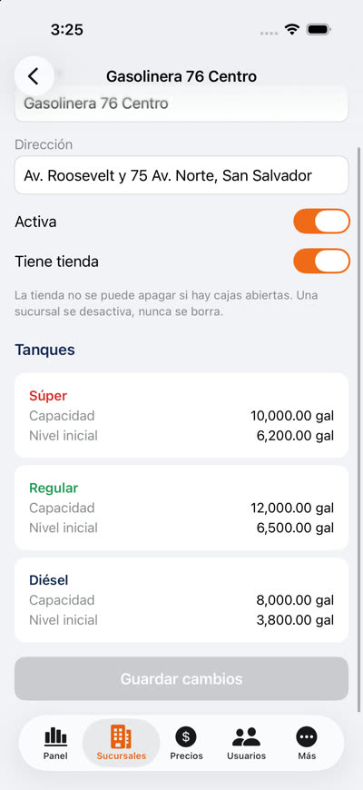 |
|---|---|
| *Edición* | *Interruptores y tanques* |

**Qué es y para qué sirve.** Cambia el nombre, la dirección o el estado de una sucursal existente.

**Cómo funciona.**

- Nombre y dirección editables. Interruptores **Activa** (una sucursal se desactiva, nunca se borra) y **Tiene tienda** (no se puede apagar si hay cajas abiertas).
- Los **tanques** (capacidad y nivel inicial) se ven en solo lectura: no se editan.
- **Guardar cambios** queda gris hasta que se modifica algo válido.

### Nueva sucursal (hoja)

| 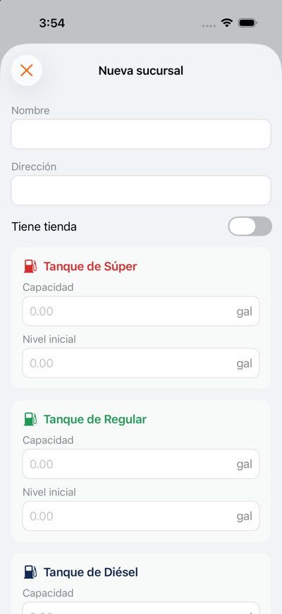 | 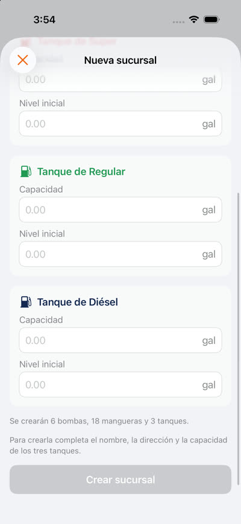 |
|---|---|
| *Formulario* | *Final del formulario* |

**Qué es y para qué sirve.** Crea una sucursal nueva con todo lo necesario para operar.

**Cómo funciona.**

- Datos: **nombre**, **dirección** y el interruptor **Tiene tienda**.
- Para cada combustible (Súper, Regular, Diésel): **capacidad** del tanque (obligatoria, mayor que 0) y **nivel inicial** (opcional: si se deja vacío queda en 0, y no puede superar la capacidad).
- Al crearla se generan automáticamente **6 bombas, 18 mangueras y 3 tanques**.
- **Crear sucursal** está gris mientras falte algo, y un texto explica qué: «Para crearla completa el nombre, la dirección y la capacidad de los tres tanques.»

### Precios

| 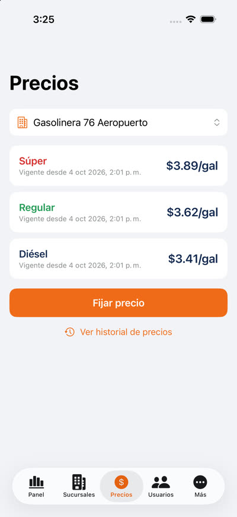 |
|---|
| *Precios vigentes* |

**Qué es y para qué sirve.** Muestra el precio vigente de cada combustible en la sucursal elegida y es la puerta para cambiarlos. Solo el Gerente General fija precios.

**Cómo funciona.**

- Selector de sucursal; tres filas con el precio por galón y la fecha desde la que rige. Si falta un precio sale el aviso «Sin precio: la sucursal no podrá cerrar cortes».
- **Fijar precio** abre la hoja para cambiarlo. **Ver historial de precios** muestra los anteriores.

### Fijar precio (hoja)

| 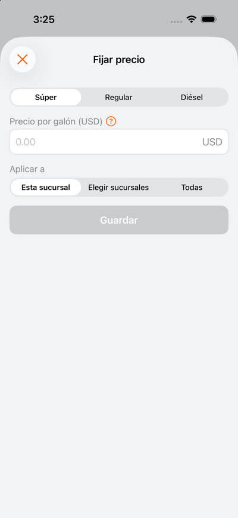 | 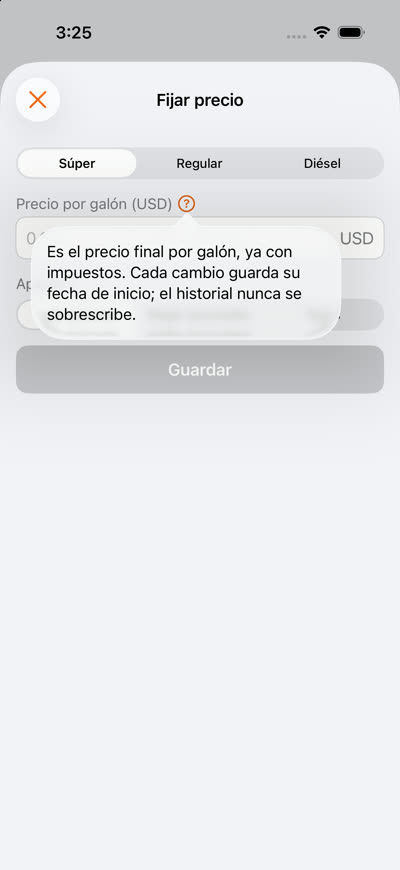 | 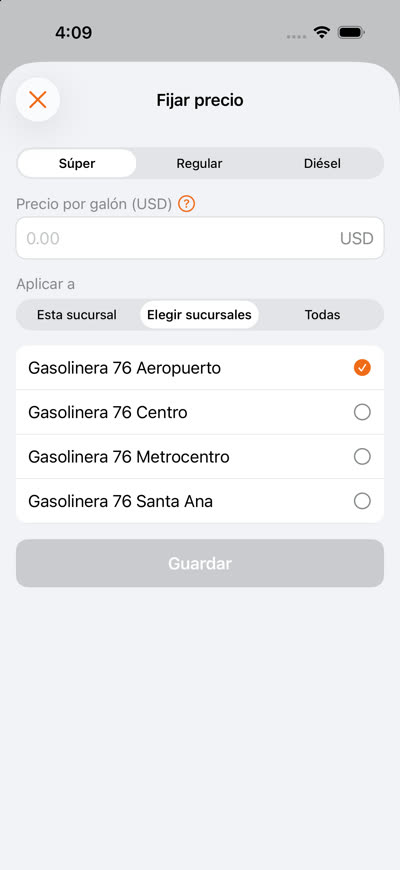 |
|---|---|---|
| *Hoja* | *Ayuda del precio* | *Elegir sucursales* |

**Qué es y para qué sirve.** Cambia el precio de un combustible en una, varias o todas las sucursales a la vez.

**Cómo funciona.**

- Se elige el **combustible**, el **precio por galón** (mayor que 0, hasta 2 decimales; es el precio final con impuestos; el **?** lo explica) y **Aplicar a**: Esta sucursal · Elegir sucursales · Todas.
- Con «Elegir sucursales» aparece una lista con casillas. **Guardar** queda gris hasta que el precio y el destino sean válidos.
- Cada cambio guarda su fecha de inicio: el historial nunca se sobrescribe. El corte usa el precio vigente en el momento de cerrarse.

### Historial de precios

| 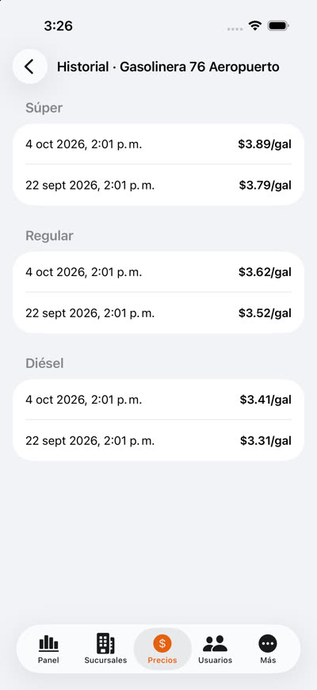 |
|---|
| *Historial* |

**Qué es y para qué sirve.** Lista cronológica de los precios que ha tenido cada combustible en la sucursal. Solo consulta.

**Cómo funciona.**

- Agrupado por combustible, del más reciente al más antiguo, con fecha y hora de inicio.

### Usuarios

| 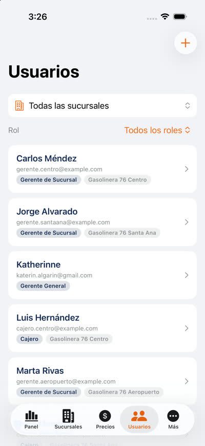 |
|---|
| *Lista de usuarios* |

**Qué es y para qué sirve.** Lista de las cuentas del sistema. Desde aquí se crean usuarios y se administran los existentes.

**Cómo funciona.**

- Filtros por **sucursal** y por **rol**. Cada fila muestra nombre, correo, rol, sucursal y la etiqueta **Inactivo** si corresponde. Tocar una fila abre su edición; el **+** abre «Nuevo usuario».

### Nuevo usuario (hoja)

| 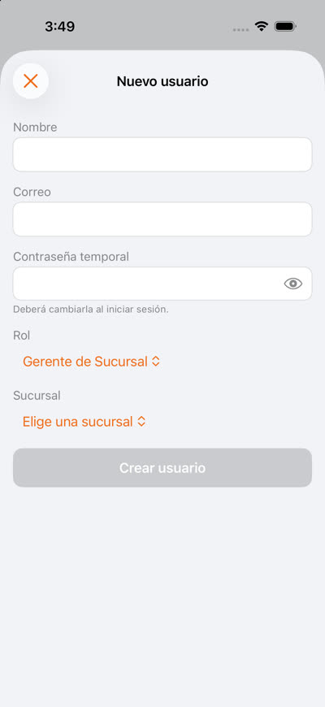 |
|---|
| *Formulario* |

**Qué es y para qué sirve.** Crea una cuenta nueva (la Edge Function `gestionar-usuarios` lo hace en el servidor; la app nunca guarda claves secretas).

**Cómo funciona.**

- **Nombre**, **correo** (formato válido) y **contraseña temporal** (8 a 72 caracteres, con ojo para verla). El usuario deberá cambiarla al iniciar sesión.
- **Rol**: Gerente General, Gerente de Sucursal o Cajero (menú desplegable). Para los dos últimos aparece **Sucursal** (el Cajero solo puede asignarse a sucursales con tienda).
- **Crear usuario** queda gris hasta que todo es válido. Errores del servidor, por ejemplo: «Esa sucursal ya tiene un Gerente de Sucursal activo.» o correo repetido.

### Editar usuario

| 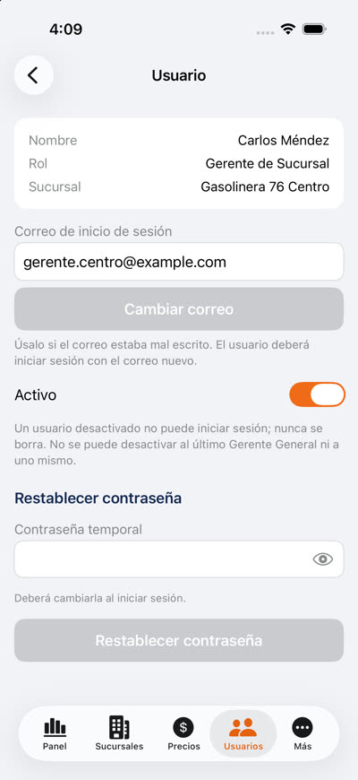 |
|---|
| *Edición* |

**Qué es y para qué sirve.** Permite corregir el correo, activar/desactivar la cuenta y restablecer la contraseña.

**Cómo funciona.**

- **Cambiar correo**: para cuando se escribió mal; el usuario deberá iniciar sesión con el correo nuevo. No se puede cambiar el propio.
- Interruptor **Activo**: un usuario desactivado no puede entrar y nunca se borra. No se puede desactivar al último Gerente General ni a uno mismo.
- **Restablecer contraseña**: se escribe una contraseña temporal nueva; el usuario deberá cambiarla al entrar.

### Más

| 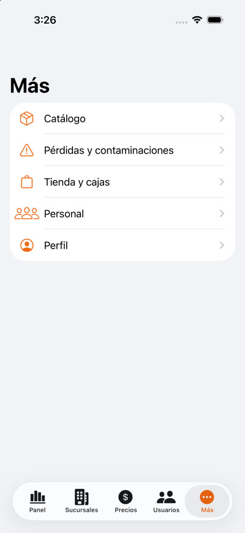 |
|---|
| *Menú Más* |

**Qué es y para qué sirve.** Menú con lo que no cabe en la barra inferior.

**Cómo funciona.**

- **Catálogo**, **Pérdidas y contaminaciones**, **Tienda y cajas**, **Personal** y **Perfil**.

### Catálogo

| 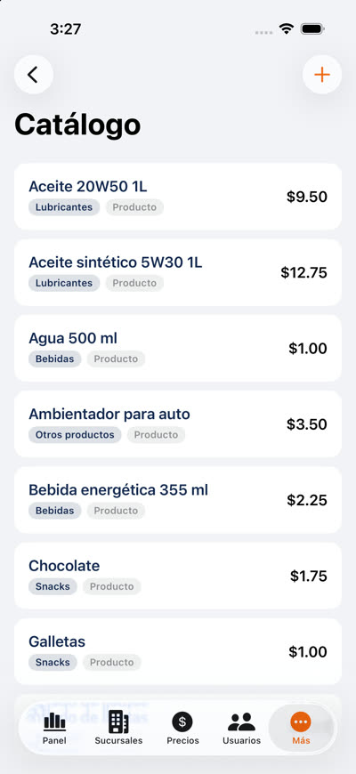 |
|---|
| *Catálogo* |

**Qué es y para qué sirve.** Lista de productos y servicios de la tienda, comunes a toda la franquicia.

**Cómo funciona.**

- Cada fila: nombre, categoría, tipo (Producto o Servicio) y precio; **Inactivo** si está desactivado. El **+** crea un artículo; tocar una fila lo edita.

### Nuevo artículo (hoja)

| 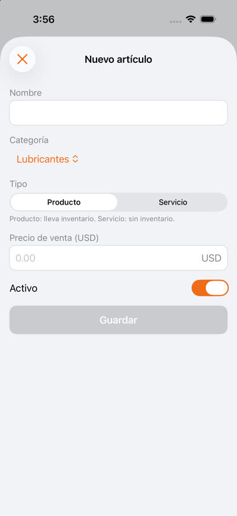 |
|---|
| *Formulario* |

**Qué es y para qué sirve.** Alta de un producto (con inventario) o un servicio (sin inventario).

**Cómo funciona.**

- **Nombre**, **categoría** (Lubricantes, Bebidas, Snacks, Otros productos, Servicios), **tipo** (Producto o Servicio; si la categoría es Servicios, el tipo queda en Servicio), **precio de venta** (mayor que 0) y el interruptor **Activo**.
- Al editar un artículo existente, el tipo y la categoría ya no se pueden cambiar. **Guardar** queda gris hasta que nombre y precio son válidos.

### Pérdidas y contaminaciones

| 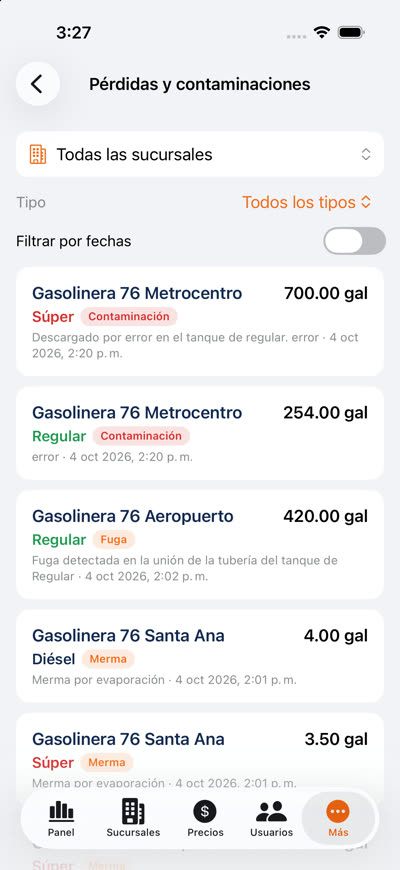 |
|---|
| *Lista de pérdidas* |

**Qué es y para qué sirve.** Lista global de las pérdidas de combustible registradas en cualquier sucursal.

**Cómo funciona.**

- Filtros: sucursal, **tipo** (Merma, Fuga, Falla técnica, Derrame, Contaminación) y un interruptor **Filtrar por fechas**.
- Cada fila: sucursal, combustible, tipo, galones, nota y fecha. Las de **Contaminación** llevan etiqueta propia (tocarla explica qué es).

> Nota: Las filas de Metrocentro son pruebas de la usuaria (vaciado por descarga errónea con la nota «error»).

### Tienda y cajas

| 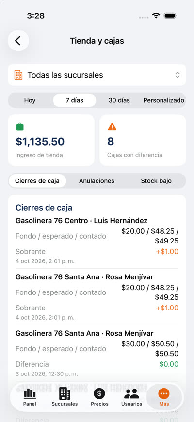 | 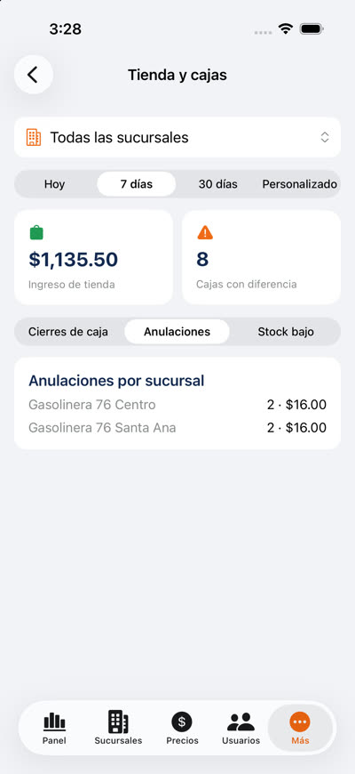 | 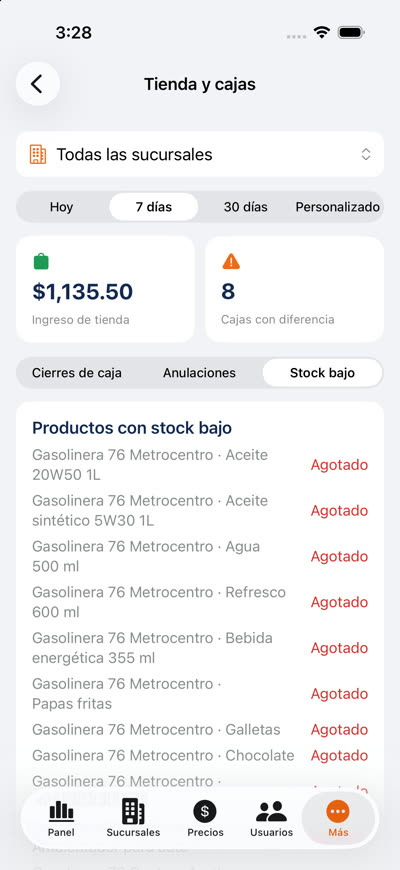 |
|---|---|---|
| *Cierres de caja* | *Anulaciones* | *Stock bajo* |

| 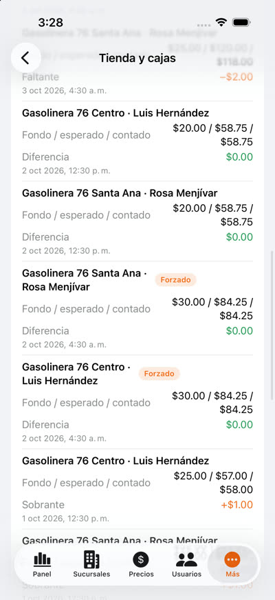 | 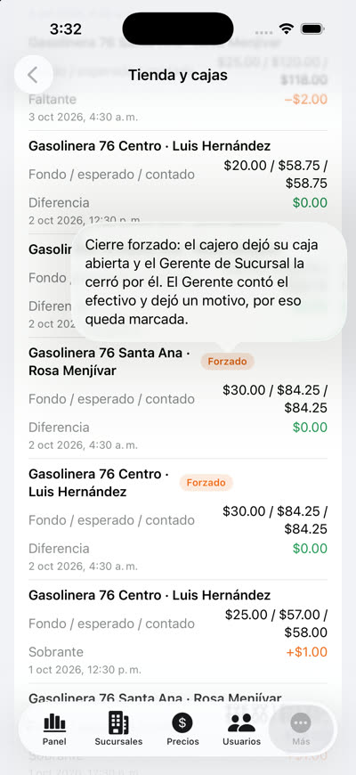 |
|---|---|
| *Cierres, más abajo* | *Explicación de «Forzado»* |

**Qué es y para qué sirve.** Vista de consulta de la tienda de todas las sucursales: cuánto se vendió, cómo cerraron las cajas y qué productos se están acabando.

**Cómo funciona.**

- Arriba: sucursal, periodo (Hoy · 7 días · 30 días · Fechas) y dos tarjetas: **Ingreso de tienda** y **Cajas con diferencia**.
- Un selector de tres secciones evita una pantalla larguísima: **Cierres de caja**, **Anulaciones** y **Stock bajo**.
- **Cierres de caja**: por cajero, fondo / esperado / contado, y la diferencia (Sobrante, Faltante, o $0.00 en verde). La etiqueta **Forzado** se puede tocar para ver qué significa.
- **Anulaciones**: por sucursal, cuántas ventas se anularon y su monto. **Stock bajo**: productos que llegaron al mínimo; los que están en cero dicen «Agotado».

> Nota: Las tres primeras capturas muestran la pestaña de periodo con el nombre antiguo («Personalizado»); la app actual dice «Fechas».

### Personal (consulta)

| 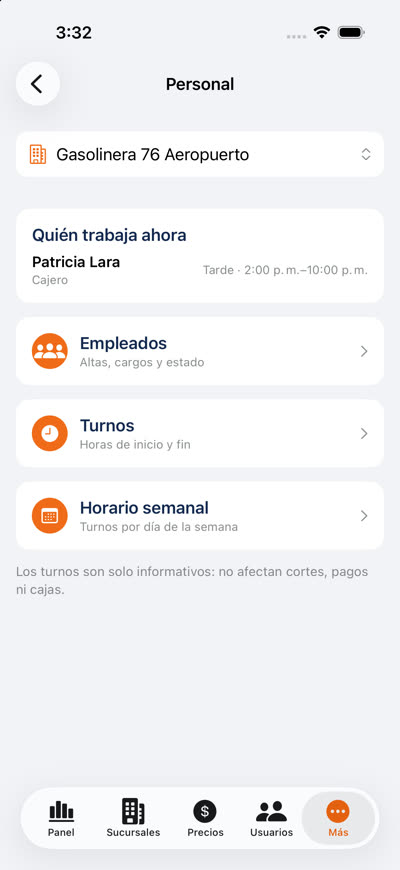 | 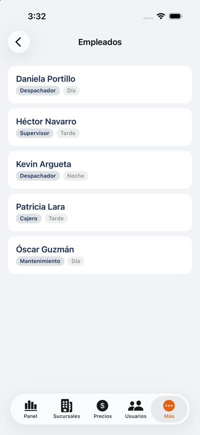 | 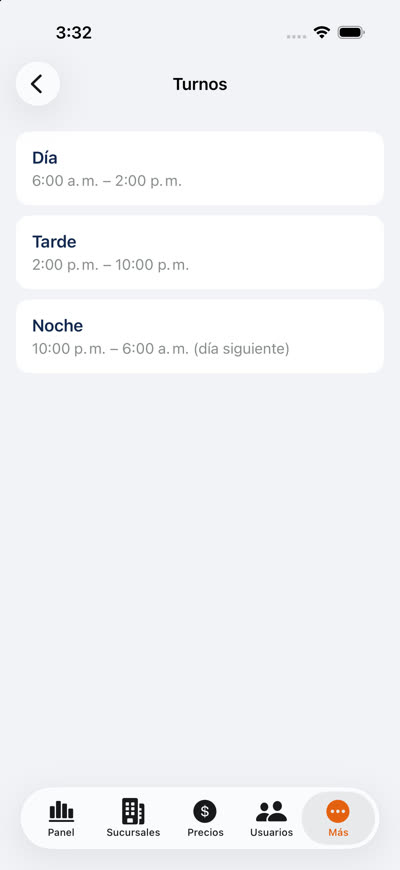 |
|---|---|---|
| *Personal* | *Empleados* | *Turnos* |

| 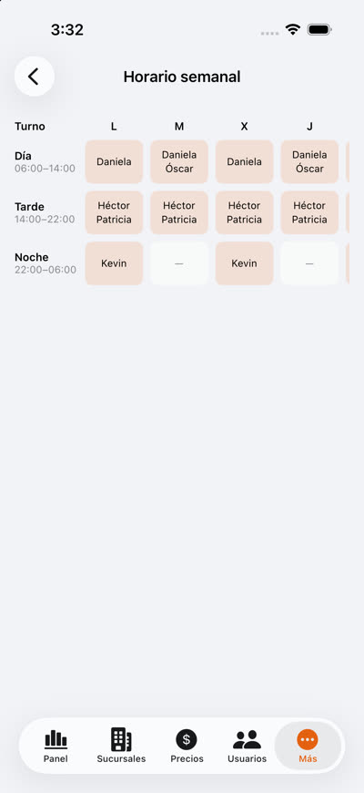 | 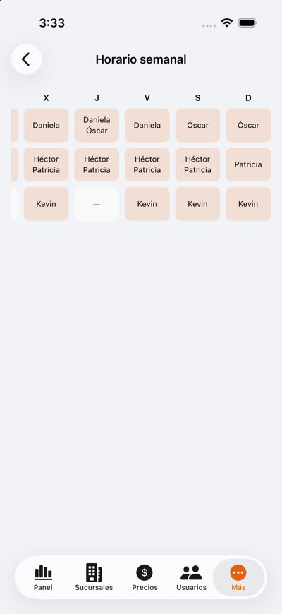 |
|---|---|
| *Horario semanal* | *Horario, fin de semana* |

**Qué es y para qué sirve.** El Gerente General ve el personal de cualquier sucursal, sin poder editarlo (lo administra el Gerente de Sucursal). Los turnos son solo informativos: no afectan cortes, pagos ni cajas.

**Cómo funciona.**

- Selector de sucursal. **Quién trabaja ahora** muestra los empleados activos del turno actual.
- **Empleados**: nombre, cargo y turno. **Turnos**: horas de inicio y fin (el turno «Noche» termina al día siguiente). **Horario semanal**: cuadrícula de turnos por día de la semana (se desliza hacia la derecha).

### Pantallas del Gerente General sin captura

**Qué es y para qué sirve.** Acciones que existen pero que no se ejecutaron para no modificar datos reales.

**Cómo funciona.**

- **Crear un usuario, restablecer una contraseña o cambiar un correo**: se capturaron los formularios vacíos; las probaron antes por HTTP contra el servidor (crear 201, correo repetido 409, restablecer, desactivar, cambiar correo).
- **Guardar un precio, una sucursal o un artículo**: se ven los formularios y su validación, pero no se confirmó ninguno.
- **Guardar un ajuste de lectura**: ver la nota de la pantalla correspondiente.

> 📷 **Sin captura.** Cualquier guardado cambia la base de datos real; varias de esas cosas (cortes, ventas, ajustes) son además inmutables.

## 3. Gerente de Sucursal

Ve y opera **solo su sucursal**. Su barra inferior: **Inicio · Corte · Tienda · Personal · Más**. «Tienda» y «Cajeros» solo aparecen si la sucursal tiene tienda. Es quien registra el **corte** (la captura de lecturas, compras, pérdidas y niveles) y quien administra la tienda, el personal y los cajeros.

### Inicio

| 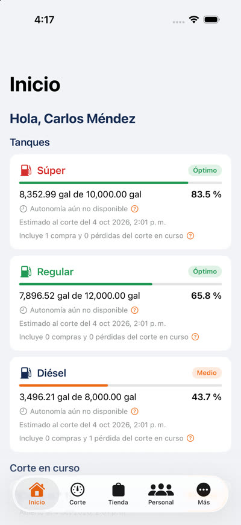 | 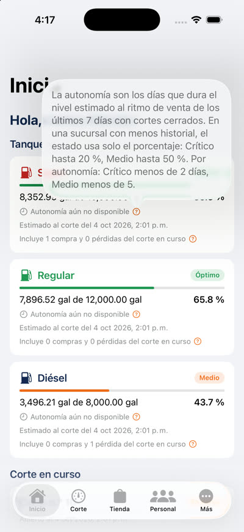 | 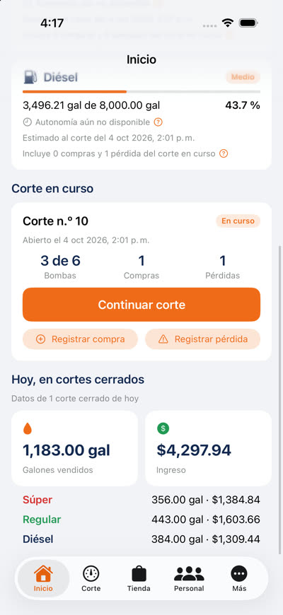 |
|---|---|---|
| *Tanques* | *Ayuda de autonomía* | *Corte en curso y resumen de hoy* |

**Qué es y para qué sirve.** Pantalla de bienvenida con el estado de los tanques y del corte en curso. Responde: «¿cómo está mi sucursal ahora?».

**Cómo funciona.**

- **Tanques** (Súper, Regular, Diésel): galones, porcentaje, barra y estado (Óptimo/Medio/Crítico, que se pueden tocar para ver su regla). «Estimado al corte del …» dice de cuándo es el dato y «Incluye N compras y M pérdidas del corte en curso» aclara qué se sumó desde entonces.
- **Autonomía**: días que dura el combustible al ritmo de ventas de los últimos 7 días. En sucursales con poco historial dice «Autonomía aún no disponible» y el estado usa solo el porcentaje. El **?** explica la regla completa.
- **Corte en curso**: bombas guardadas (3 de 6), compras y pérdidas. **Continuar corte** lleva a la pestaña Corte; **Registrar compra** y **Registrar pérdida** son atajos.
- **Hoy, en cortes cerrados**: galones e ingreso de los cortes cerrados hoy, por combustible; «Sin cortes cerrados hoy» si no hay.

### Corte en curso (centro del flujo)

| 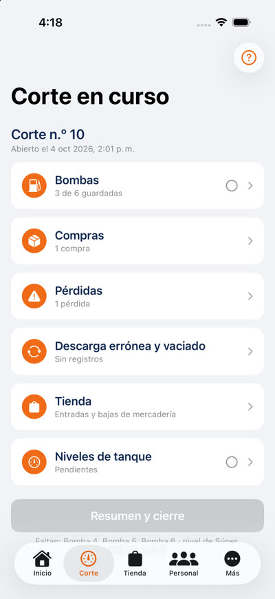 | 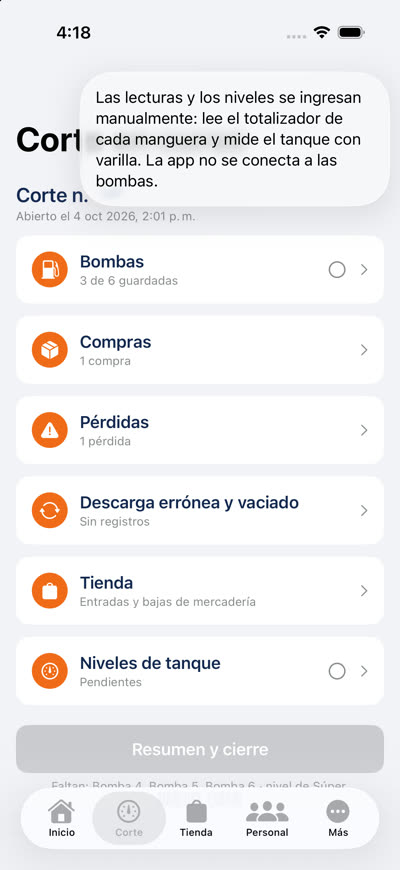 | 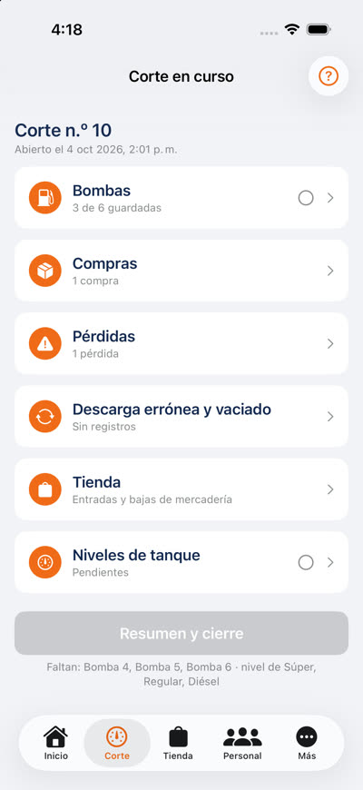 |
|---|---|---|
| *Corte en curso* | *Ayuda de captura manual* | *Qué falta para cerrar* |

**Qué es y para qué sirve.** Es el tablero del corte abierto. Un **corte** es el cierre de un turno de combustible: se captura qué marcó cada manguera, se registran compras y pérdidas, se mide cada tanque y se cierra. Hay dos por día (Matutino y Vespertino).

**Cómo funciona.**

- Lista de secciones con su estado: **Bombas** (3 de 6 guardadas), **Compras**, **Pérdidas**, **Descarga errónea y vaciado**, **Tienda** (si hay) y **Niveles de tanque**.
- **Resumen y cierre** está gris hasta tener las 6 bombas y los 3 niveles; debajo dice qué falta: «Faltan: Bomba 4, Bomba 5, Bomba 6 · nivel de Súper, Regular, Diésel».
- El **?** de arriba recuerda que las lecturas y los niveles se ingresan **a mano**: se lee el totalizador de cada manguera y se mide el tanque con varilla; la app no se conecta a las bombas.

### Bombas

| 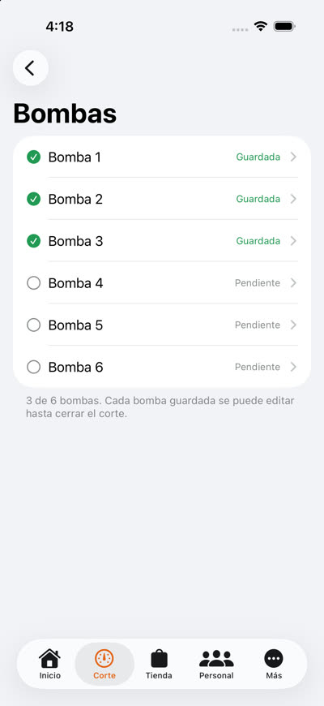 |
|---|
| *Lista de bombas* |

**Qué es y para qué sirve.** Lista de las 6 bombas del corte, para capturar las lecturas de sus 3 mangueras.

**Cómo funciona.**

- Cada bomba está **Pendiente** (círculo vacío) o **Guardada** (✓). Una bomba guardada se puede volver a abrir y editar hasta que se cierre el corte.

### Bomba N (captura de lecturas)

| 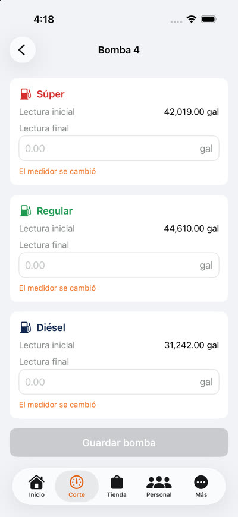 |
|---|
| *Bomba 4, sin datos* |

**Qué es y para qué sirve.** Formulario de una bomba: una tarjeta por manguera (Súper, Regular, Diésel).

**Cómo funciona.**

- Se escribe la **lectura final** del totalizador de cada manguera. La **lectura inicial** aparece como dato fijo: es la final del corte anterior.
- En el **primer corte de la sucursal** también se pide la lectura inicial (una sola vez), con un **?** que lo explica.
- Reglas de validación: sin letras, sin negativos y máximo 2 decimales; la final no puede ser menor que la inicial («La lectura final no puede ser menor que la inicial»). **Guardar bomba** queda gris hasta que las tres sean válidas.
- El enlace **El medidor se cambió** abre la hoja de cambio de medidor.

> Nota: Se capturó la bomba sin datos escritos; no se guardó nada para no alterar el corte real en curso.

### Cambio de medidor (hoja)

| 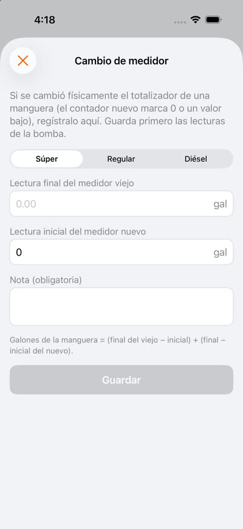 |
|---|
| *Hoja* |

**Qué es y para qué sirve.** Para cuando se reemplazó físicamente el contador de una manguera (el nuevo marca 0 o un valor bajo): evita que los galones salgan negativos o absurdos.

**Cómo funciona.**

- Se elige la manguera, la **lectura final del medidor viejo**, la **lectura inicial del nuevo** (normalmente 0) y una **nota** obligatoria.
- Los galones de esa manguera pasan a ser (final del viejo − inicial) + (final − inicial del nuevo). El corte queda marcado «Cambio de medidor».
- Si ya existe, se puede ver, corregir o **quitar** el cambio.

### Compras

| 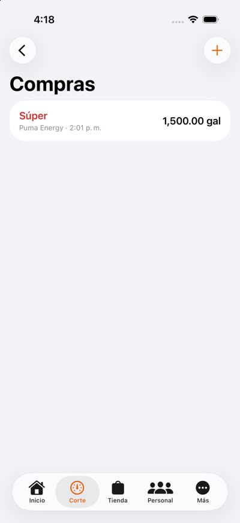 |
|---|
| *Lista de compras* |

**Qué es y para qué sirve.** Registro de las descargas de combustible que llegaron en este corte (camiones cisterna).

**Cómo funciona.**

- Lista con combustible, galones, proveedor y hora. El **+** abre «Nueva compra». Tocar una fila (o deslizarla hacia la izquierda) permite **Editar** o **Eliminar**. Las compras que genera un vaciado quedan bloqueadas y dicen «Generada por una descarga errónea».

### Nueva compra (hoja)

| 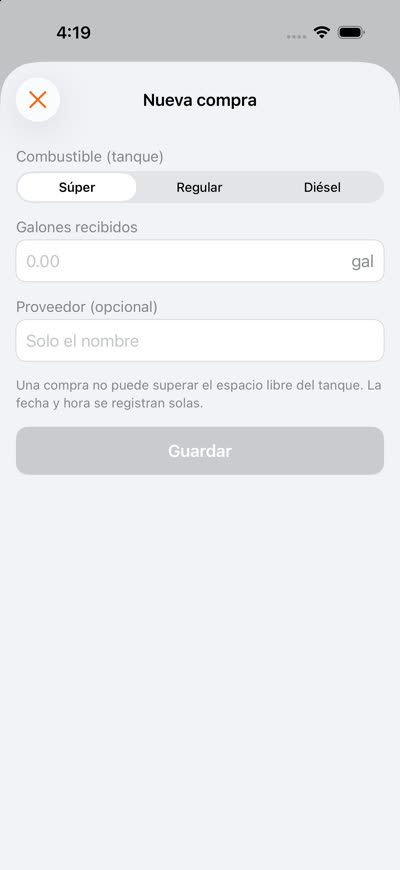 |
|---|
| *Formulario* |

**Qué es y para qué sirve.** Alta de una descarga recibida en un tanque.

**Cómo funciona.**

- Se elige el **tanque** (combustible), los **galones recibidos** (mayor que 0) y el **proveedor** (opcional, solo el nombre). La fecha y la hora se registran solas.
- Si la compra excede el espacio libre del tanque, el servidor lo rechaza: «La compra excede el espacio libre del tanque (libre: N gal).»

### Pérdidas

| 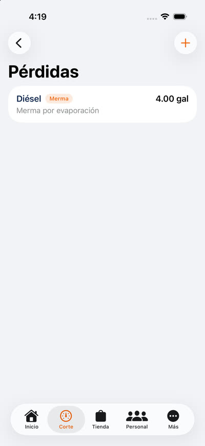 |
|---|
| *Lista de pérdidas* |

**Qué es y para qué sirve.** Registro de combustible que se perdió y no se vendió: mermas, fugas, fallas o derrames.

**Cómo funciona.**

- Lista con tipo, combustible, galones y nota. El **+** abre «Nueva pérdida»; también se puede editar o eliminar tocando o deslizando la fila. Las pérdidas que genera un vaciado (Contaminación) llevan un candado y no se editan. «Sin pérdidas registradas» si está vacía.

### Nueva pérdida (hoja)

| 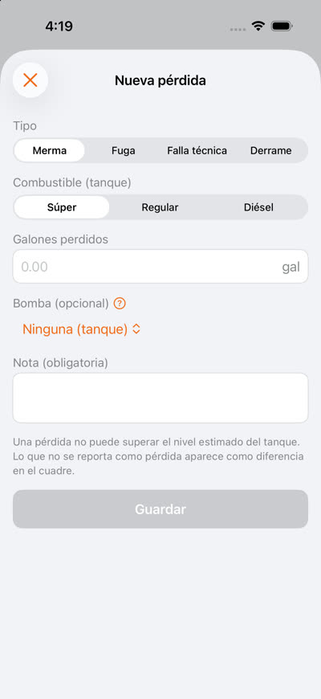 |
|---|
| *Formulario* |

**Qué es y para qué sirve.** Alta de una pérdida de combustible.

**Cómo funciona.**

- **Tipo**: Merma, Fuga, Falla técnica o Derrame. **Combustible**, **galones perdidos** (mayor que 0 y no más que el nivel estimado del tanque) y **nota** obligatoria.
- **Bomba (opcional)**: un derrame o una falla ocurre en una bomba; una fuga, en el tanque. El **?** lo explica.
- Lo que no se reporta como pérdida aparece luego como diferencia en el cuadre.

### Descarga errónea y vaciado (hoja)

| 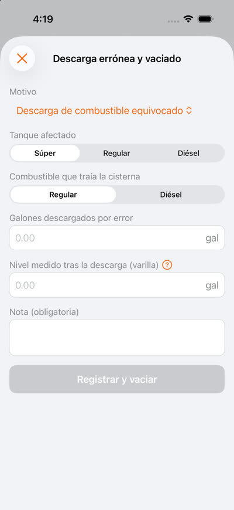 | 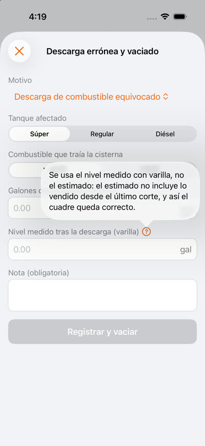 |
|---|---|
| *Formulario* | *Ayuda del nivel medido* |

**Qué es y para qué sirve.** Para cuando se descargó combustible en el tanque equivocado, o hay que vaciar un tanque por contaminación o mantenimiento. No existe un botón de «vaciar» sin motivo.

**Cómo funciona.**

- **Motivo**: «Descarga de combustible equivocado» u «Otra contaminación o mantenimiento».
- **Tanque afectado**; con el primer motivo también el **combustible que traía la cisterna** y los **galones descargados por error**.
- **Nivel medido tras la descarga (varilla)**: se usa el medido y no el estimado (el **?** explica por qué). **Nota** obligatoria.
- Una vista previa lista lo que se va a registrar («Se registrarán…»: pérdida de X gal, compra y pérdida de Y gal del otro combustible, y que el tanque quedará en 0).
- **Registrar y vaciar** (botón rojo) pide confirmación. Genera las pérdidas de tipo Contaminación y, si fue descarga errónea, una compra del otro combustible; ya no se pueden editar.

> Nota: Se capturó el formulario vacío; registrar un vaciado cambia los niveles del tanque y no se puede deshacer.

### Niveles de tanque

| 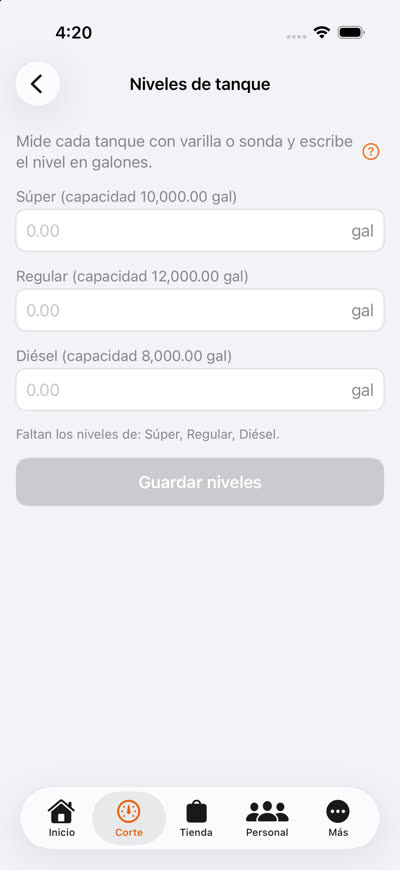 |
|---|
| *Niveles de tanque* |

**Qué es y para qué sirve.** Se mide cada tanque con varilla o sonda y se escribe el nivel en galones. Estos niveles son los que se comparan con el cálculo del sistema (el cuadre) al cerrar el corte.

**Cómo funciona.**

- Un campo por tanque (Súper, Regular, Diésel), mostrando su capacidad. No pueden superarla.
- **Guardar niveles** queda gris con el texto «Faltan los niveles de: …» hasta tener los tres. Los niveles se guardan en el teléfono y se envían al cerrar el corte.

### Resumen y cierre

**Qué es y para qué sirve.** Vista previa de cómo quedará el corte **antes** de cerrarlo, calculada por el servidor con los mismos números del cierre real.

**Cómo funciona.**

- Si es el **primer corte** de la sucursal, pregunta si es Matutino o Vespertino (desde el segundo se alternan solos).
- Tarjetas de **galones** e **ingreso**, y una tarjeta por combustible: vendido, precio vigente, ingreso, compras, pérdidas, nivel teórico, nivel medido y el indicador **Cuadra / Diferencia**.
- Avisos que bloquean el cierre: «La sucursal no tiene precio de … Pídele al Gerente General que lo fije.» o «Hay N cajas abiertas: cierra las cajas antes de cerrar el corte.»
- La diferencia del cuadre es solo un indicador: no impide cerrar. **Cerrar corte** abre la ventana «¿Cerrar el corte? Después de cerrarlo no se podrá modificar.»

> 📷 **Sin captura.** Para llegar aquí deben estar guardadas las 6 bombas y los 3 niveles, lo que exige teclear lecturas reales y, al final, **cerrar el corte, que es permanente e inmutable**. No se hizo para no alterar los datos reales de la sucursal.

### Corte cerrado

**Qué es y para qué sirve.** Confirmación después de cerrar el corte.

**Cómo funciona.**

- Muestra «Corte cerrado», el tipo (Matutino/Vespertino) y la fecha operativa, y avisa que ya no se puede modificar y que el siguiente corte quedó abierto con las lecturas iniciales derivadas.
- **Ver reporte** abre el reporte del corte; **Volver al inicio** regresa a Inicio.

> 📷 **Sin captura.** Es el resultado de cerrar un corte (ver «Resumen y cierre»).

### Tienda · Inventario

| 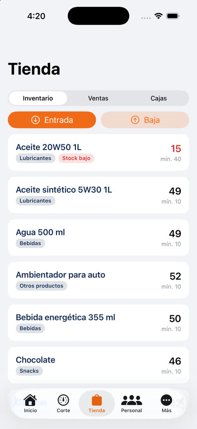 | 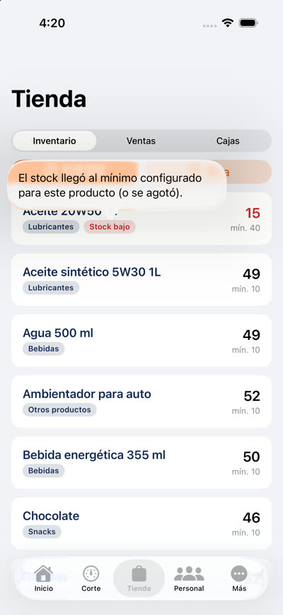 |
|---|---|
| *Inventario* | *Explicación de «Stock bajo»* |

**Qué es y para qué sirve.** Inventario de la tienda de la sucursal: qué hay y qué falta. Aparece solo si la sucursal tiene tienda.

**Cómo funciona.**

- Cada producto muestra su stock y el **mínimo** configurado; la etiqueta **Stock bajo** se puede tocar para ver su significado.
- Arriba, **Entrada** (llegó mercadería) y **Baja** (se pierde mercadería). Un selector separa **Inventario · Ventas · Cajas**.

### Entrada y baja de mercadería (hojas)

| 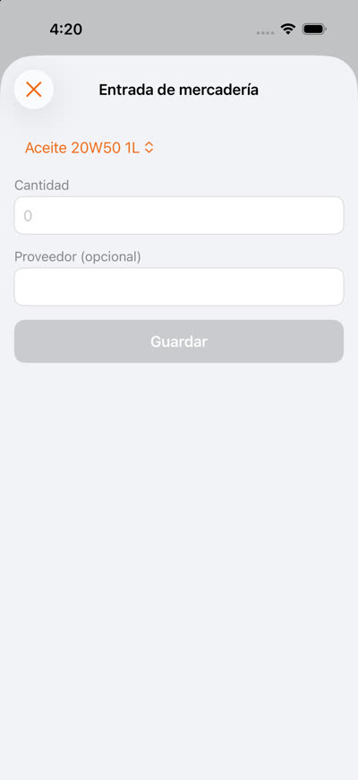 | 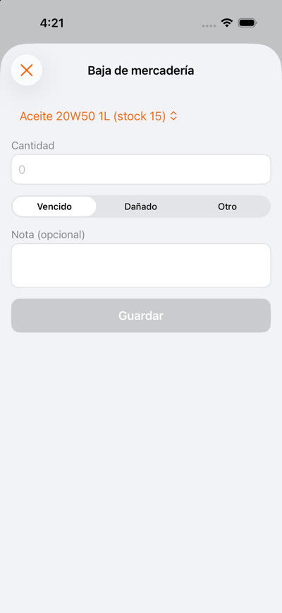 |
|---|---|
| *Entrada* | *Baja* |

**Qué es y para qué sirve.** Mantienen el inventario al día.

**Cómo funciona.**

- **Entrada**: producto, cantidad entera mayor que 0 y proveedor opcional.
- **Baja**: producto, cantidad (no más que el stock), **motivo** (Vencido, Dañado u Otro; con «Otro» la nota es obligatoria).

### Tienda · Ventas y anulación

| 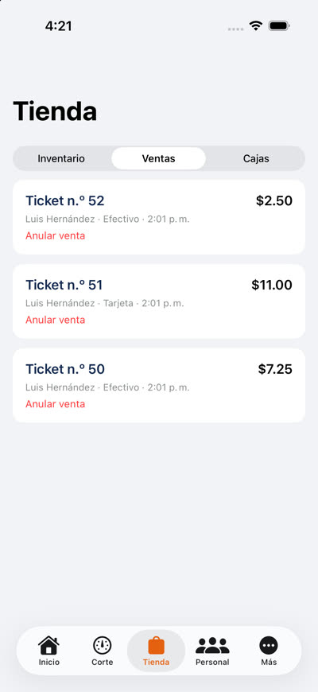 | 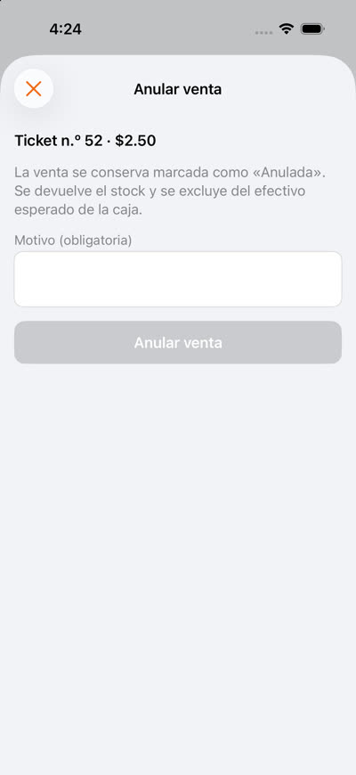 |
|---|---|
| *Ventas* | *Hoja «Anular venta»* |

**Qué es y para qué sirve.** Tickets vendidos por los cajeros en el corte. El Gerente puede anular una venta si la caja de esa venta sigue abierta.

**Cómo funciona.**

- Cada ticket: número, cajero, método, hora y total; las anuladas llevan la etiqueta **Anulada**.
- **Anular venta** abre una hoja que pide un **motivo** obligatorio. La venta se conserva marcada, se devuelve el stock y no cuenta en el efectivo esperado de la caja.
- Si la caja ya se cerró, la venta es definitiva y no se puede anular.

> Nota: No se anuló ninguna venta.

### Tienda · Cajas y cierre forzado

| 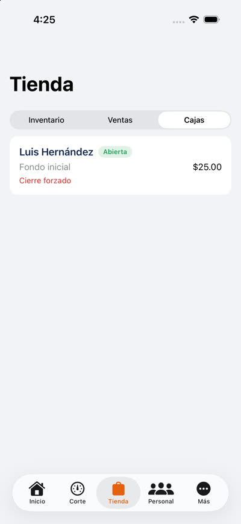 | 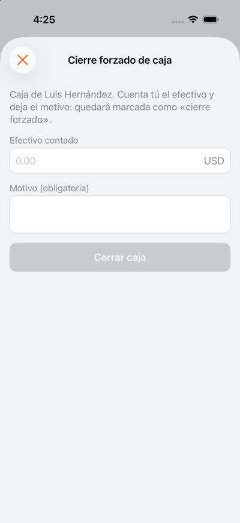 |
|---|---|
| *Cajas* | *Cierre forzado* |

**Qué es y para qué sirve.** Estado de las cajas de los cajeros en el corte. Una caja abierta bloquea el cierre del corte.

**Cómo funciona.**

- Cada caja: cajero, estado (**Abierta** o cerrada), fondo inicial y, si cerró, esperado / contado / diferencia. La etiqueta **Forzado** indica que la cerró el Gerente.
- **Cierre forzado**: cuando un cajero se fue sin cerrar. La hoja pide el **efectivo contado** y un **motivo** obligatorio; la caja queda marcada «Forzado».

> Nota: No se forzó ninguna caja.

### Personal

| 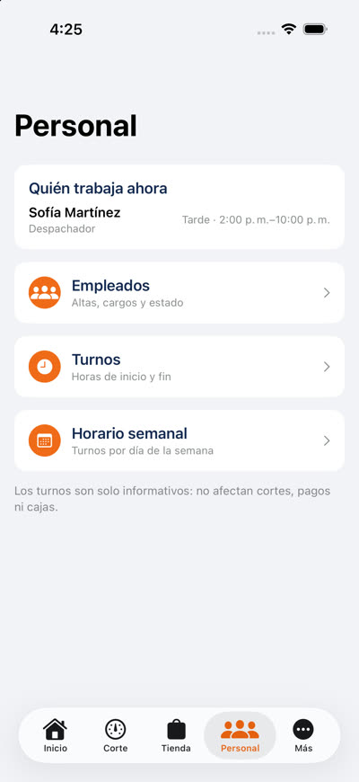 | 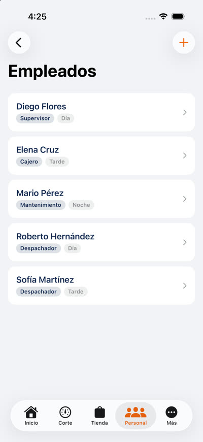 |
|---|---|
| *Personal* | *Empleados* |

**Qué es y para qué sirve.** El Gerente de Sucursal administra los empleados de su sucursal (no son usuarios de la app) y sus turnos. Los turnos son solo informativos: no afectan cortes, pagos ni cajas.

**Cómo funciona.**

- **Quién trabaja ahora**: empleados activos del turno actual («Nadie en turno» si hay un hueco).
- Accesos a **Empleados**, **Turnos** y **Horario semanal**.

### Nuevo empleado y nuevo turno (hojas)

| 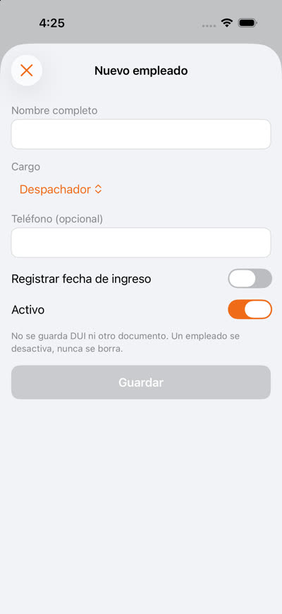 | 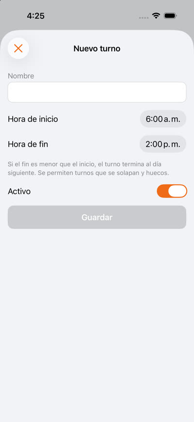 |
|---|---|
| *Nuevo empleado* | *Nuevo turno* |

**Qué es y para qué sirve.** Altas de personal y de turnos.

**Cómo funciona.**

- **Empleado**: nombre completo, cargo (Despachador, Cajero, Supervisor, Mantenimiento, Otro), teléfono y fecha de ingreso opcionales, interruptor Activo. **No se guarda DUI ni documentos**; un empleado se desactiva, nunca se borra.
- **Turno**: nombre, hora de inicio y fin (distintas). Si el fin es menor que el inicio, el turno termina al día siguiente; se permiten turnos que se solapan y huecos.
- **Guardar** queda gris hasta que los datos son válidos.

### Horario semanal y asignar turno

| 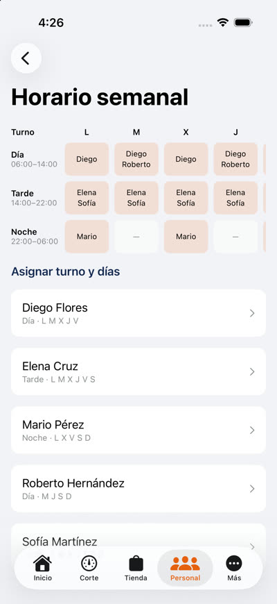 | 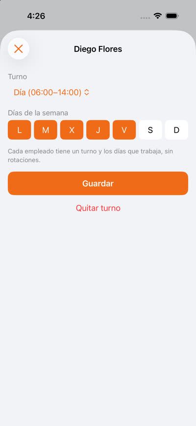 |
|---|---|
| *Horario semanal* | *Asignar turno* |

**Qué es y para qué sirve.** Cuadrícula de qué empleados trabajan cada turno cada día, y la forma de asignarlos.

**Cómo funciona.**

- La cuadrícula cruza turnos con días (L M X J V S D). Debajo, la lista «Asignar turno y días»: tocar un empleado abre una hoja.
- Cada empleado tiene **un turno y los días que trabaja**, sin rotaciones. **Guardar** aplica; **Quitar turno** lo desasigna.

### Más y historial de cortes

| 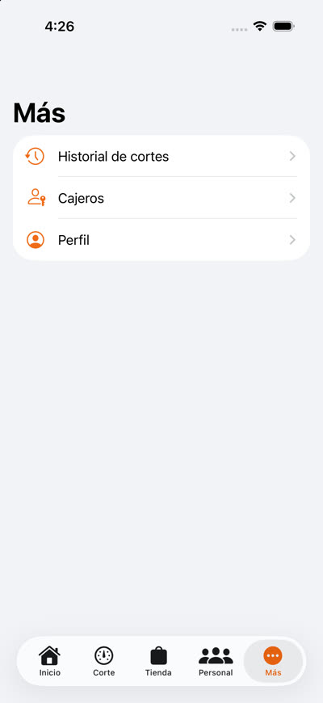 | 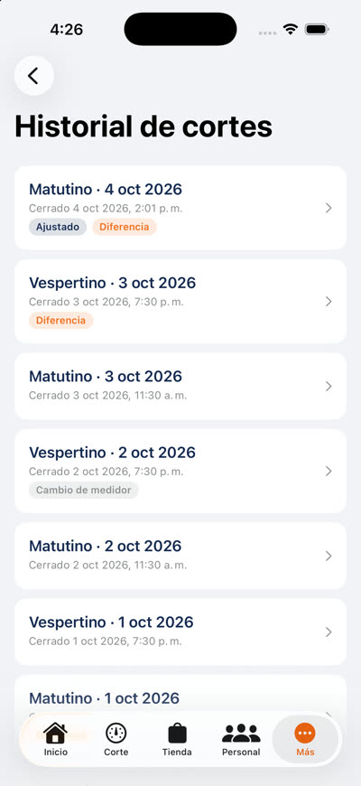 |
|---|---|
| *Menú Más* | *Historial de cortes* |

**Qué es y para qué sirve.** Menú con el historial de cortes, los cajeros y el perfil.

**Cómo funciona.**

- **Historial de cortes**: todos los cortes cerrados, del más reciente al más antiguo, con etiquetas **Ajustado**, **Diferencia** y **Cambio de medidor**. Tocar uno abre su reporte.

### Reporte de corte (vista del Gerente de Sucursal)

| 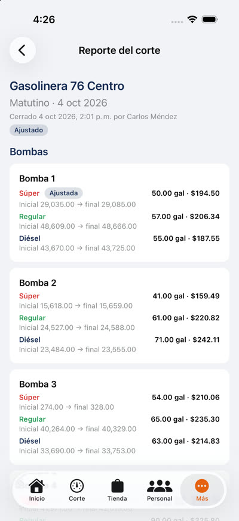 | 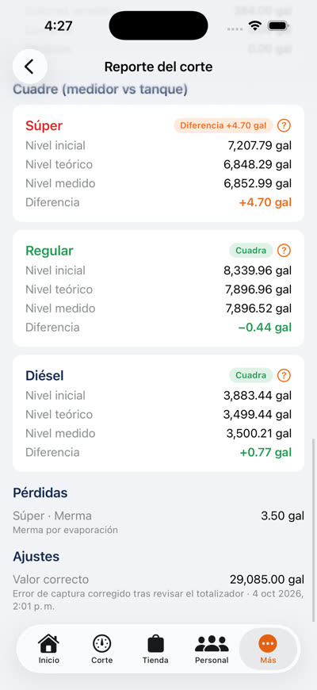 | 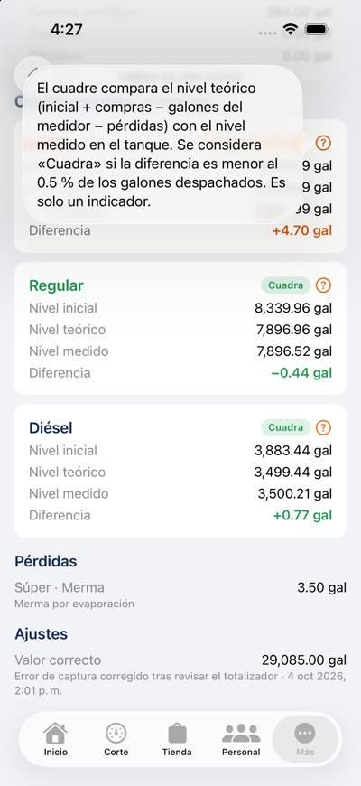 |
|---|---|---|
| *Encabezado y bombas* | *Cuadre, pérdidas y ajustes* | *Ayuda del cuadre* |

**Qué es y para qué sirve.** Es el mismo reporte que ve el Gerente General (ver sección 2), sin el botón de ajustar lectura.

**Cómo funciona.**

- Bombas, consolidado, cuadre, pérdidas y ajustes. Tocar el **?** o las etiquetas explica cada concepto.

### Cajeros

| 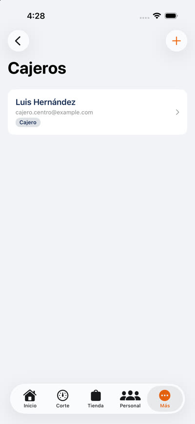 | 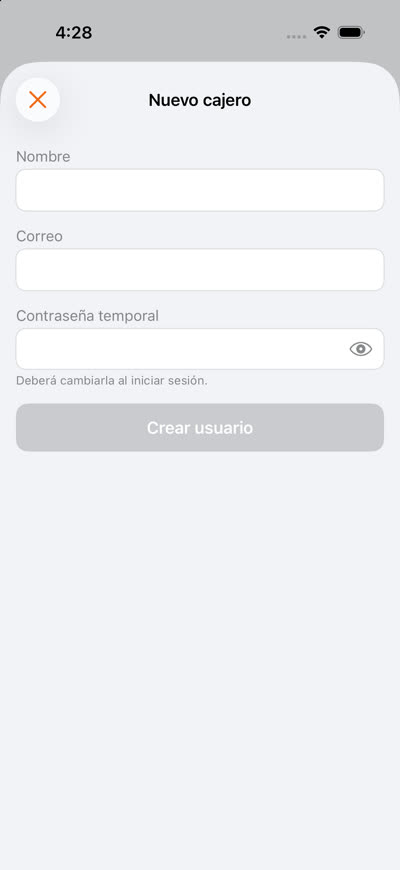 | 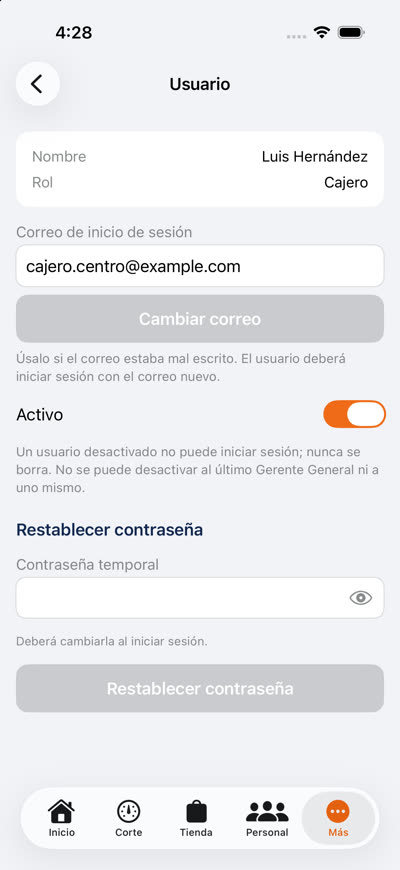 |
|---|---|---|
| *Lista* | *Nuevo cajero* | *Editar cajero* |

**Qué es y para qué sirve.** Gestión de los cajeros de la sucursal (usuarios que cobran en el POS). Solo aparece si la sucursal tiene tienda.

**Cómo funciona.**

- Lista de cajeros. El **+** abre «Nuevo cajero»: nombre, correo y contraseña temporal (se crea con rol Cajero en esta sucursal).
- Tocar un cajero abre su edición: cambiar correo, activar/desactivar y restablecer contraseña.

### Pantallas del Gerente de Sucursal sin captura

**Qué es y para qué sirve.** Varias pantallas dependen de escribir datos reales o de acciones permanentes.

**Cómo funciona.**

- **Resumen y cierre** y **Corte cerrado** (ver arriba).
- **Bomba con lecturas escritas** y sus errores de validación; el **cambio de medidor** con datos; **Guardar niveles** con los tres valores.
- **Editar o eliminar** una compra o una pérdida (se hace deslizando la fila).
- Confirmaciones de **Registrar y vaciar**, **Anular venta** y **Cierre forzado**.

> 📷 **Sin captura.** Escribir texto en los campos de esta sesión no era posible sin pegar valores, y varias de estas acciones cambian datos reales que no se pueden deshacer (cortes, ventas y cajas son inmutables). Las descripciones salen del código de la app y de `docs/FLUJO.md`, y la lógica está cubierta por las pruebas automáticas (496 verificaciones).

## 4. Cajero

Cobra en la tienda de su sucursal. Su barra inferior: **Caja · Ventas · Perfil**. Solo puede tener **una caja abierta** a la vez y **no puede anular ventas** (eso lo hace el Gerente de Sucursal). El pago con tarjeta es **simulado**: la app nunca pide datos de tarjeta.

### Caja

|  | 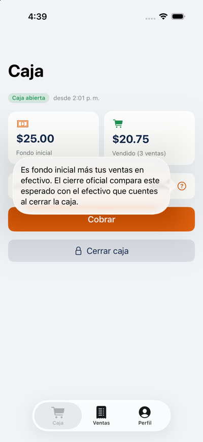 |
|---|---|
| *Caja abierta* | *Ayuda del efectivo* |

**Qué es y para qué sirve.** Pantalla principal del Cajero: el estado de su caja y el acceso a cobrar y a cerrar.

**Cómo funciona.**

- Con caja abierta: etiqueta «Caja abierta desde …», **Fondo inicial**, **Vendido** (cantidad de ventas) y **Efectivo según tus ventas** (fondo + ventas en efectivo). El **?** aclara que el cierre oficial compara ese esperado con el efectivo que se cuente.
- **Cobrar** abre el POS. **Cerrar caja** abre el cierre.

### Sin caja abierta · Abrir caja

| 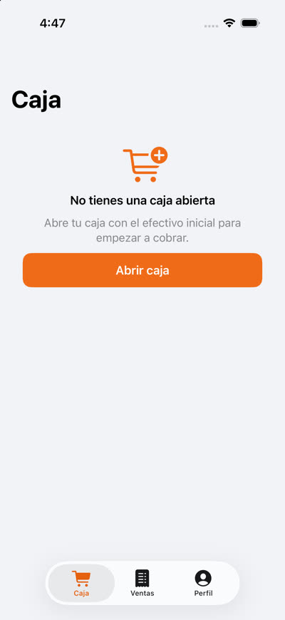 | 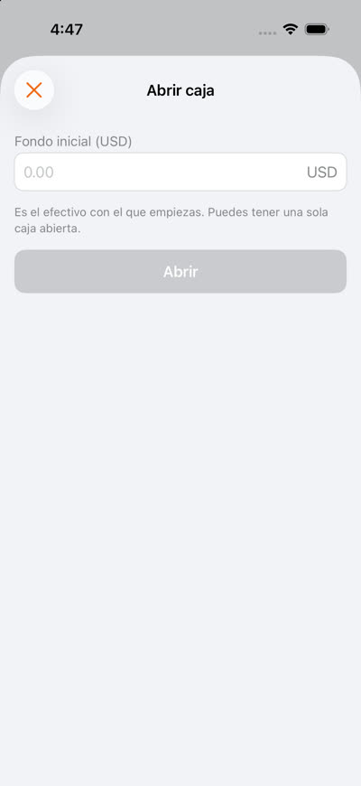 |
|---|---|
| *Sin caja* | *Hoja «Abrir caja»* |

**Qué es y para qué sirve.** Estado inicial del turno: no se puede cobrar hasta abrir una caja.

**Cómo funciona.**

- Muestra «No tienes una caja abierta» y **Abrir caja**.
- La hoja pide el **fondo inicial en USD** (puede ser 0). **Abrir** queda gris hasta que hay un valor válido. Si ya hay una caja abierta, el servidor responde «Ya tienes una caja abierta.»

> Nota: No se abrió una caja nueva en la demostración.

### Cobrar · punto de venta (POS)

| 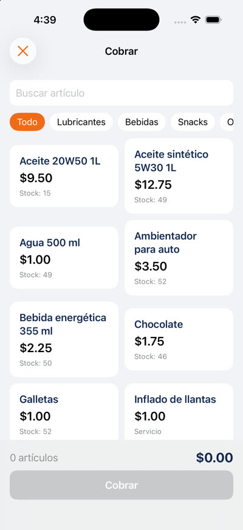 | 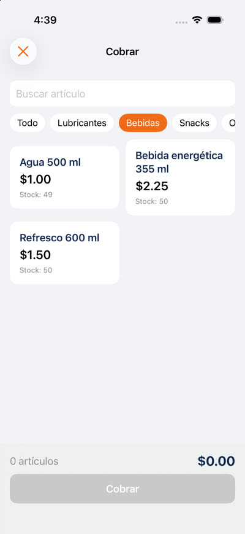 | 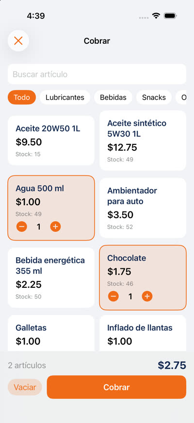 |
|---|---|---|
| *Catálogo* | *Filtro por categoría* | *Carrito con 2 artículos* |

**Qué es y para qué sirve.** Catálogo de la tienda y carrito de la venta.

**Cómo funciona.**

- Búsqueda por nombre y chips de categoría (Todo, Lubricantes, Bebidas, Snacks, …).
- Tocar un artículo lo agrega al carrito; con **＋ / −** se cambia la cantidad (entera y sin pasar del stock). Los artículos sin stock aparecen atenuados; los servicios no tienen stock.
- La barra de abajo muestra la cantidad de artículos y el total; **Vaciar** limpia el carrito y **Cobrar** abre el cobro. El total es una vista previa: el servidor lo recalcula con los precios del catálogo.

### Cobro (hoja)

| 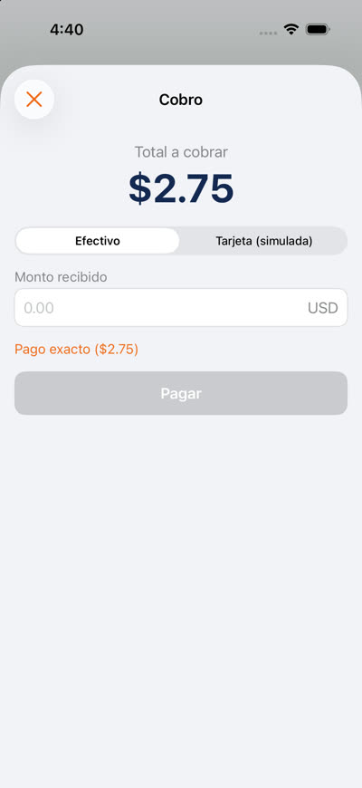 | 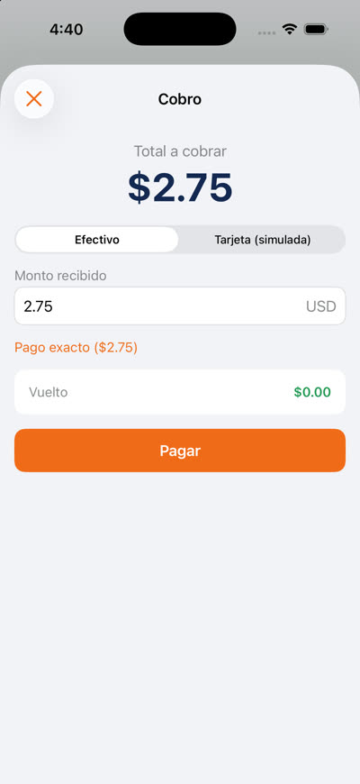 |
|---|---|
| *Cobro, sin monto* | *Con pago exacto* |

**Qué es y para qué sirve.** Cierra la venta: se elige cómo paga el cliente.

**Cómo funciona.**

- **Efectivo**: se escribe el **monto recibido**; el **vuelto** se calcula en pantalla y no se puede pagar con menos del total. **Pago exacto** llena el monto con el total.
- **Tarjeta (simulada)**: no se pide ningún dato de tarjeta.
- **Pagar** queda gris hasta que el pago es válido.

> Nota: El flujo con tarjeta y el de pagar con vuelto o con monto insuficiente no se capturaron; se comportan igual salvo por los campos descritos.

### Pago y ticket

| 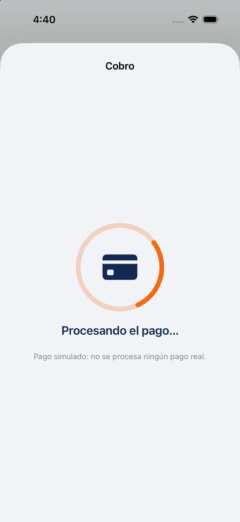 | 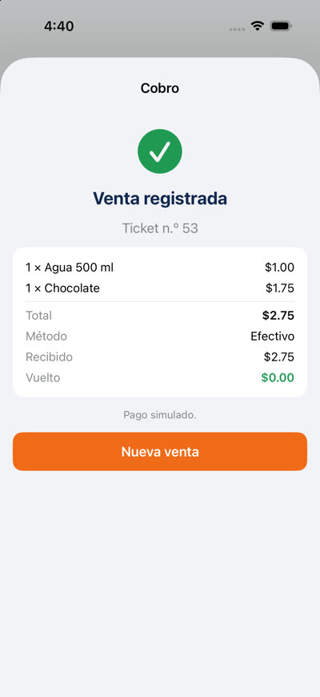 |
|---|---|
| *Procesando* | *Ticket n.º 53* |

**Qué es y para qué sirve.** Resultado de la venta.

**Cómo funciona.**

- Una animación «Procesando el pago…» dura un mínimo de unos 1.6 segundos aunque el servidor responda antes, con el aviso «Pago simulado: no se procesa ningún pago real».
- Después aparece **Venta registrada** con el número de ticket, las líneas, total, método, recibido y vuelto. **Nueva venta** vuelve al POS.
- Si el servidor rechaza la venta (por ejemplo «Stock insuficiente de …») vuelve al carrito con el mensaje.

> Nota: Esta venta (ticket n.º 53, $2.75) es real y quedó guardada en la sucursal Centro de ejemplo.

### Caja actualizada

| 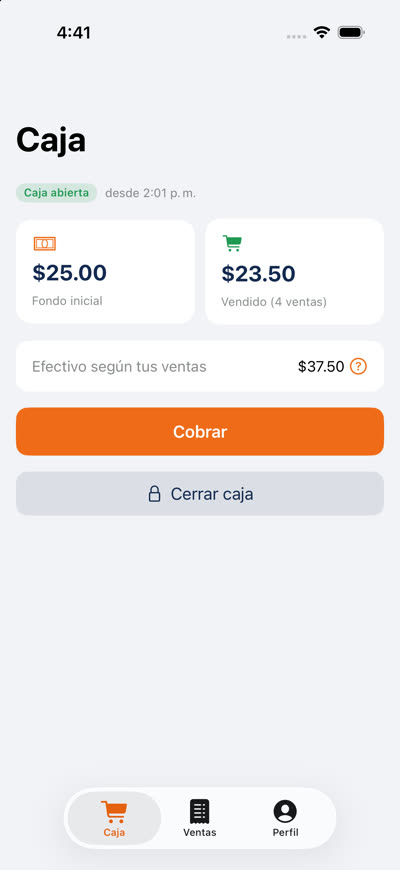 |
|---|
| *Caja con 4 ventas* |

**Qué es y para qué sirve.** Después de una venta, la pantalla Caja ya refleja el nuevo total.

**Cómo funciona.**

- Pasó de 3 a 4 ventas y de $34.75 a $37.50 de efectivo esperado.

### Ventas

| 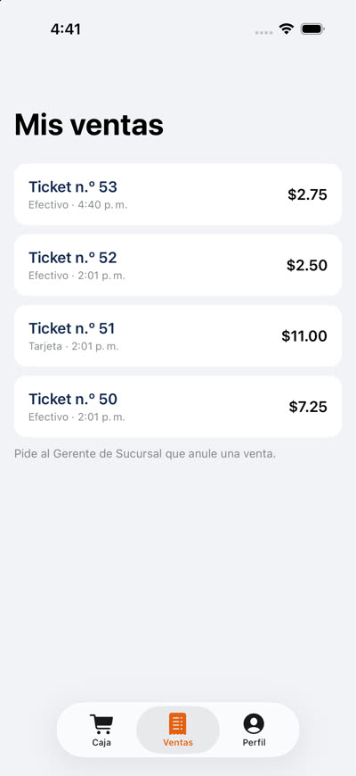 | 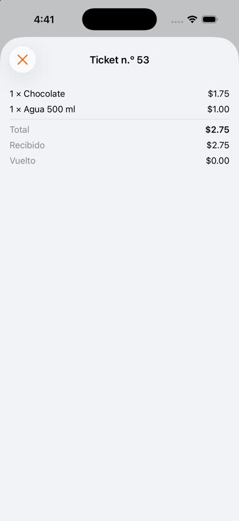 |
|---|---|
| *Mis ventas* | *Detalle de un ticket* |

**Qué es y para qué sirve.** Lista de los tickets de la caja abierta (solo de este cajero).

**Cómo funciona.**

- Cada ticket: número, método, hora y total. Tocar uno abre el detalle (líneas, total, recibido y vuelto) en solo lectura.
- Un texto aclara: «Pide al Gerente de Sucursal que anule una venta.»

### Cerrar caja

| 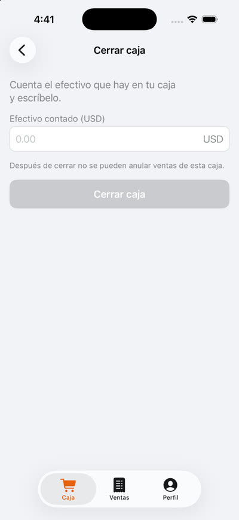 | 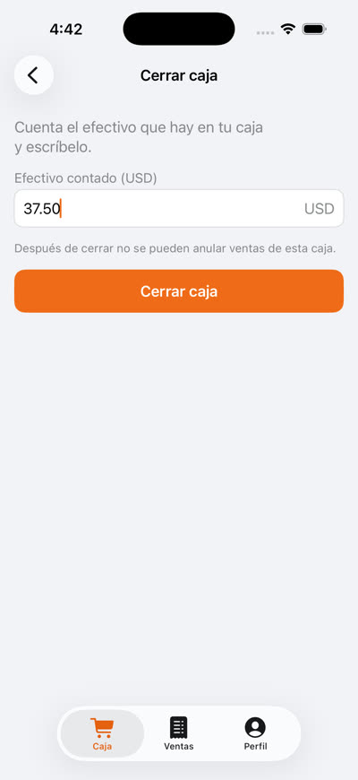 | 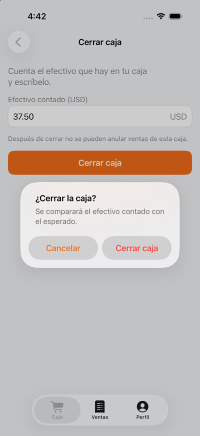 |
|---|---|---|
| *Cierre* | *Con el efectivo contado* | *Confirmación* |

| 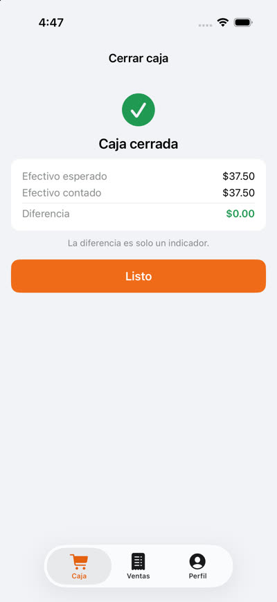 |
|---|
| *Resultado: caja cerrada, diferencia $0.00* |

**Qué es y para qué sirve.** Cierre del turno: se cuenta el efectivo y el servidor lo compara con lo esperado.

**Cómo funciona.**

- Se escribe el **efectivo contado**; el aviso recuerda que después no se pueden anular ventas de esa caja. **Cerrar caja** queda gris hasta tener un valor.
- Una ventana pide confirmar: «¿Cerrar la caja? Se comparará el efectivo contado con el esperado.»
- El resultado muestra **efectivo esperado, contado y diferencia** (faltante o sobrante). La diferencia es solo un indicador. Después, el Cajero queda sin caja abierta.

> Nota: La caja de la demostración se cerró con efectivo contado igual al esperado ($37.50).

### Pantallas del Cajero sin captura

**Qué es y para qué sirve.** Casos que no se grabaron.

**Cómo funciona.**

- **Pago con tarjeta** y **efectivo con vuelto o con monto insuficiente**.
- **Cierre de caja con faltante o sobrante** (en la demostración cerró exacto).
- Errores del servidor, como «Stock insuficiente» o «Ya tienes una caja abierta».

> 📷 **Sin captura.** Cada venta o cierre real queda guardado de forma permanente en la sucursal de ejemplo; se hizo una venta y un cierre para mostrar el flujo y no se repitieron las variantes.

## 5. Cómo se lee la app (conceptos comunes)

- Los campos numéricos **no aceptan letras, signos negativos ni más de 2 decimales** (las cantidades de tienda, solo enteros). Lo que no cabe se descarta al escribir o pegar.
- Los botones de guardar se mantienen **grises hasta que el formulario es válido**; los errores del servidor aparecen en rojo con su mensaje exacto y se quitan al volver a escribir.
- Las pantallas con datos tienen cuatro estados: **cargando**, **vacío** (con un texto útil), **error** (con «Reintentar») y **contenido**. Si una recarga falla, se conservan los datos anteriores.
- Casi toda captura de datos se hace en **hojas** que suben desde abajo (se cierran con la X) y los datos importantes tienen un **?** que abre un globo de ayuda.
- Las **etiquetas de color** (Forzado, Ajustado, Crítico, Cuadra…) se pueden tocar para ver qué significan.
- Unidades: **galones** y **dólares (USD)**. La app no calcula cuadres ni precios: los resuelve el servidor (Supabase), salvo vistas previas como el total del carrito.

### Glosario

| Término | Qué significa |
|---|---|
| **Corte** | Cierre de un turno de combustible: lecturas de las 6 bombas, compras, pérdidas y nivel medido de los 3 tanques. Hay 2 por día (Matutino y Vespertino). Un corte cerrado es inmutable. |
| **Cuadre** | Compara el nivel teórico del tanque (inicial + compras − galones del medidor − pérdidas) con el nivel medido. «Cuadra» si la diferencia es menor al 0.5 % de los galones despachados. Es solo un indicador. |
| **Estado del tanque** | Crítico: 20 % o menos, o autonomía menor a 2 días. Medio: 50 % o menos, o autonomía menor a 5 días. Óptimo: lo demás. Vale el peor de los dos criterios. |
| **Autonomía** | Días que dura el combustible al ritmo de venta de los últimos 7 días con cortes cerrados. En sucursales con poco historial no se muestra y el estado usa solo el porcentaje. |
| **Ajustado** | El Gerente General corrigió una lectura después de cerrar el corte; la original se conserva. |
| **Cambio de medidor** | Se reemplazó el contador de una manguera durante el corte. |
| **Contaminación** | Pérdida por descarga en el tanque equivocado, agua u otro problema; la genera «Descarga errónea y vaciado». |
| **Forzado** | Caja que el Gerente de Sucursal cerró por el cajero, con el efectivo contado y un motivo. |
| **Anulada** | Venta anulada por el Gerente de Sucursal mientras su caja seguía abierta; se conserva marcada y se devuelve el stock. |
| **Stock bajo / Agotado** | El stock llegó al mínimo configurado (o a cero). |
| **Inactivo / Inactiva** | Nada se borra: se desactiva y conserva su historial. |

## 6. Lo que no se pudo capturar

Estas pantallas están descritas arriba a partir del código, pero **no tienen captura ni salen en los videos**, por los motivos indicados.

| Pantalla o acción | Por qué no se capturó |
|---|---|
| Recuperar contraseña (pasos 2 y 3) y Cambio obligatorio | Los hace la usuaria directamente: implican escribir un correo, un código de verificación y contraseñas. Descritos desde el código. |
| Resumen y cierre del corte, ventana de confirmación y Corte cerrado | Exigen guardar las 6 bombas y los 3 niveles con datos reales y terminan en una acción **permanente** (cerrar el corte). No se ejecutó. Descritos desde el código. |
| Bomba con lecturas, cambio de medidor con datos, Guardar niveles con valores | Habría que teclear lecturas reales en un corte real en curso. Se capturaron los formularios vacíos. Su validación está cubierta por las pruebas automáticas. |
| Editar/eliminar compras y pérdidas, vaciado, anular venta, cierre forzado, ajustar lectura | Cada una modifica datos reales de forma irreversible o difícil de revertir. Se capturaron los formularios y se describió el efecto. |
| Crear usuarios, precios, sucursales o artículos | Se capturaron los formularios y su validación; no se guardó ninguno. El servidor de usuarios se probó aparte por HTTP. |
| Pago con tarjeta, pago con vuelto, cierre de caja con diferencia | Solo se mostró un flujo de venta y un cierre de caja (ambos reales y permanentes). |
| Un intento de cerrar la caja bloqueado | Durante la demostración el sistema de permisos de la herramienta bloqueó el último toque de «Cerrar caja»; lo confirmó la usuaria a mano y el resultado quedó capturado (cj-53). |

> Dos capturas del Panel y tres de «Tienda y cajas» (`gg-10`, `gg-10b`, `gg-54` a `gg-56`) muestran el nombre antiguo de la pestaña de periodo («Personalizado»); la app actual dice «Fechas». Conviene recapturarlas con la sesión del Gerente General.
